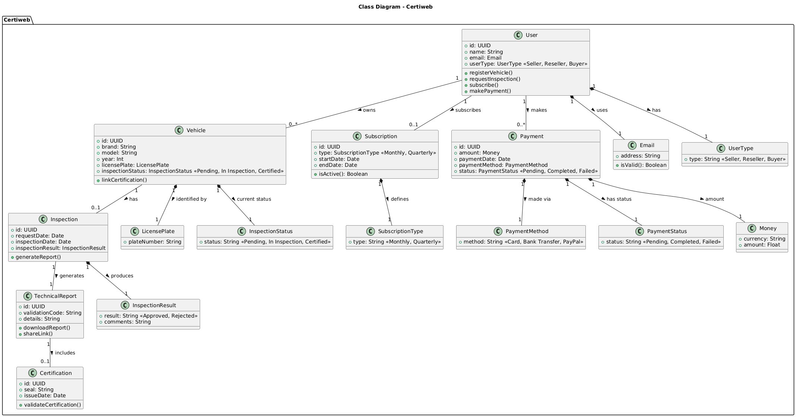

<!--* caratula -->

<div align="center">

# Informe Trabajo Final 📙


### Universidad Peruana de Ciencias Aplicadas ♨️

🧑‍💻 Ingeniería de software - 2025-02

**Sección:** 7500

**Docente:** Ivan Robles Fernández

**StartUp:** RepLink

**Producto:** CertiWeb

<div align='left'>	

~~~C#
static string[] Integrantes() {
    return new string[] {
        "🧑‍💻Quiroz Zambrano, Fabrizio Javier - u202213406"",
        "👩‍💻 Angulo Abud, Juan Carlos - u202317692,
        "👩‍💻 Trillo Hernandez, Anghel Melanie - u201912401,
        "👩‍💻 Zúñiga Murillo, Diego Sebastián - U202310636,
    };
}
~~~

<!-- Registro de versiones -->
<h1 align="left">Registro de versiones del Informe</h1>
<br>

<table border="1" cellpadding="10" cellspacing="0" style="border-collapse: collapse; width: 100%; font-family: system-ui, -apple-system, Segoe UI, Roboto, Arial, sans-serif; font-size: 14px;">
  <thead>
    <tr style="background:#f7f7f7;">
      <td align="center" style="border: 1px solid #ddd; padding: 8px; width: 10%;">Versión</td>
      <td align="center" style="border: 1px solid #ddd; padding: 8px; width: 12%;">Fecha</td>
      <td align="center" style="border: 1px solid #ddd; padding: 8px; width: 33%;">Autores</td>
      <td align="center" style="border: 1px solid #ddd; padding: 8px;">Descripción</td>
    </tr>
  </thead>
  <tbody>
    <tr>
      <td style="border: 1px solid #ccbebeff; padding: 8px; font-weight: 600;">TB1</td>
      <td style="border: 1px solid #ddd; padding: 8px;">21/09/2025</td>
      <td style="border: 1px solid #ddd; padding: 8px;">
        <ul style="margin:0 0 0 18px;">
          <li>Angulo Abud, Juan Carlos - u202317692</li>
          <li>Trillo Hernandez, Anghel Melanie - u201912401</li>
          <li>Zúñiga Murillo, Diego Sebastián - U202310636</li>
          <li>Fabrizio Javier Quiroz Zambrano – U202213406</li>
        </ul>
      </td>
      <td style="border: 1px solid #ddd; padding: 8px;">
        <strong>Proyecto:</strong> RepLink – CertiWeb
        <ul style="margin:6px 0 0 18px;">
          <li>Capítulo I: Introducción</li>
          <li>Capítulo II: Requirements Elicitation & Analysis</li>
          <li>Capítulo III: Requirements Specification</li>
          <li>Capítulo IV: Product Design</li>
          <li>Capítulo V: Product Implementation, Validation & Deployment (hasta el primer sprint)</li>
          <li>Avance de Conclusiones, Bibliografía y Anexos</li>
        </ul>
      </td>
    </tr>
  </tbody>
</table>
<br>


# Contenido del Informe

- [Capítulo I: Introducción](#capítulo-i-introducción)
  - [1.1. Startup Profile](#11-startup-profile)
    - [1.1.1. Descripción de la Startup](#111-descripción-de-la-startup)
    - [1.1.2. Perfiles de integrantes del equipo](#112-perfiles-de-integrantes-del-equipo)
  - [1.2. Solution Profile](#12-solution-profile)
    - [1.2.1. Antecedentes y problemática](#121-antecedentes-y-problemática)
    - [1.2.2. Lean UX Process](#122-lean-ux-process)
      - [1.2.2.1. Lean UX Problem Statements](#1221-lean-ux-problem-statements)
      - [1.2.2.2. Lean UX Assumptions](#1222-lean-ux-assumptions)
      - [1.2.2.3. Lean UX Hypothesis Statements](#1223-lean-ux-hypothesis-statements)
      - [1.2.2.4. Lean UX Canvas](#1224-lean-ux-canvas)
  - [1.3. Segmentos objetivo](#13-segmentos-objetivo)

- [Capítulo II: Requirements Elicitation & Analysis](#capítulo-ii-requirements-elicitation--analysis)
  - [2.1. Competidores](#21-competidores)
    - [2.1.1. Análisis competitivo](#211-análisis-competitivo)
    - [2.1.2. Estrategias y tácticas frente a competidores](#212-estrategias-y-tácticas-frente-a-competidores)
  - [2.2. Entrevistas](#22-entrevistas)
    - [2.2.1. Diseño de entrevistas](#221-diseño-de-entrevistas)
    - [2.2.2. Registro de entrevistas](#222-registro-de-entrevistas)
    - [2.2.3. Análisis de entrevistas](#223-análisis-de-entrevistas)
  - [2.3. Needfinding](#23-needfinding)
    - [2.3.1. User Personas](#231-user-personas)
    - [2.3.2. User Task Matrix](#232-user-task-matrix)
    - [2.3.3. User Journey Mapping](#233-user-journey-mapping)
    - [2.3.4. Empathy Mapping](#234-empathy-mapping)
    - [2.3.5. As-is Scenario Mapping](#235-as-is-scenario-mapping)
  - [2.4. Ubiquitous Language](#24-ubiquitous-language)

- [Capítulo III: Requirements Specification](#capítulo-iii-requirements-specification)
  - [3.1. To-Be Scenario Mapping](#31-to-be-scenario-mapping)
  - [3.2. User Stories](#32-user-stories)
  - [3.3. Impact Mapping](#33-impact-mapping)
  - [3.4. Product Backlog](#34-product-backlog)

- [Capítulo IV: Product Design](#capítulo-iv-product-design)
  - [4.1. Style Guidelines](#41-style-guidelines)
    - [4.1.1. General Style Guidelines](#411-general-style-guidelines)
    - [4.1.2. Web Style Guidelines](#412-web-style-guidelines)
  - [4.2. Information Architecture](#42-information-architecture)
    - [4.2.1. Organization Systems](#421-organization-systems)
    - [4.2.2. Labeling Systems](#422-labeling-systems)
    - [4.2.3. SEO Tags and Meta Tags](#423-seo-tags-and-meta-tags)
    - [4.2.4. Searching Systems](#424-searching-systems)
    - [4.2.5. Navigation Systems](#425-navigation-systems)
  - [4.3. Landing Page UI Design](#43-landing-page-ui-design)
    - [4.3.1. Landing Page Wireframe](#431-landing-page-wireframe)
    - [4.3.2. Landing Page Mock-up](#432-landing-page-mock-up)
  - [4.4. Web Applications UX/UI Design](#44-web-applications-uxui-design)
    - [4.4.1. Web Applications Wireframes](#441-web-applications-wireframes)
    - [4.4.2. Web Applications Wireflow Diagrams](#442-web-applications-wireflow-diagrams)
    - [4.4.3. Web Applications Mock-ups](#443-web-applications-mock-ups)
    - [4.4.4. Web Applications User Flow Diagrams](#444-web-applications-user-flow-diagrams)
  - [4.5. Web Applications Prototyping](#45-web-applications-prototyping)
  - [4.6. Domain-Driven Software Architecture](#46-domain-driven-software-architecture)
    - [4.6.1. Software Architecture Context Diagram](#461-software-architecture-context-diagram)
    - [4.6.2. Software Architecture Container Diagrams](#462-software-architecture-container-diagrams)
    - [4.6.3. Software Architecture Components Diagrams](#463-software-architecture-components-diagrams)
  - [4.7. Software Object-Oriented Design](#47-software-object-oriented-design)
    - [4.7.1. Class Diagrams](#471-class-diagrams)
    - [4.7.2. Class Dictionary](#472-class-dictionary)
  - [4.8. Database Design](#48-database-design)
    - [4.8.1. Database Diagram](#481-database-diagram)

- [Capítulo V: Product Implementation, Validation & Deployment](#capítulo-v-product-implementation-validation--deployment)
  - [5.1. Software Configuration Management](#51-software-configuration-management)
    - [5.1.1. Software Development Environment Configuration](#511-software-development-environment-configuration)
    - [5.1.2. Source Code Management](#512-source-code-management)
    - [5.1.3. Source Code Style Guide & Conventions](#513-source-code-style-guide--conventions)
    - [5.1.4. Software Deployment Configuration](#514-software-deployment-configuration)
- [5.2. Product Implementation & Deployment](#52-product-implementation--deployment)
  - [5.2.1. Sprint Backlogs](#521-sprint-backlogs)
  - [5.2.2. Implemented Landing Page Evidence](#522-implemented-landing-page-evidence)
  - [5.2.3. Implemented Frontend-Web Application Evidence](#523-implemented-frontend-web-application-evidence)
  - [5.2.4. Implemented Native-Mobile Application Evidence](#524-implemented-native-mobile-application-evidence)
  - [5.2.5. Implemented RESTful API and/or Serverless Backend Evidence](#525-implemented-restful-api-andor-serverless-backend-evidence)
  - [5.2.6. RESTful API Documentation](#526-restful-api-documentation)
  - [5.2.7. Team Collaboration Insights](#527-team-collaboration-insights)
- [5.3. Video About-the-Product](#53-video-about-the-product)


- [Conclusiones](#conclusiones)
- [Bibliografía](#bibliografía)
- [Anexos](#anexos)

  ## Student Outcome  ABET–EAC-Student Outcome 4 (RepLink – CertiWeb)

| Criterio específico | Acciones realizadas (TB1) | Conclusiones (TB1) |
|---|---|---|
| **4.c.1 Reconoce responsabilidad ética y profesional en situaciones de ingeniería de software** |Fabrizio Quiroz:
Durante el desarrollo del proyecto asumí una participación activa en la validación técnica de los entregables y en la redacción de apartados clave, asegurando que las decisiones adoptadas respetaran principios de transparencia y buenas prácticas en ingeniería de software. Mi contribución se centró en garantizar la coherencia y veracidad de la documentación, así como en mantener un estándar ético en la presentación de evidencias y en la integración del informe completo.Me encargué del despliegue del frontend y backend del proyecto CertiWeb en GitHub Pages y Render, verificando su integración y correcto funcionamiento. Asumí la responsabilidad de garantizar que el producto estuviera disponible y operativo, cumpliendo con los estándares de calidad y confiabilidad esperados. | El despliegue exitoso evidenció la importancia de la responsabilidad profesional y ética, ya que asegurar la disponibilidad del sistema impacta directamente en la confianza de los usuarios y en la seriedad del trabajo en equipo. |
| **4.c.2 Emite juicios informados considerando el impacto de las soluciones de ingeniería de software en contextos globales, económicos, ambientales y sociales** |Fabrizio Quiroz:
Colaboré en la construcción y revisión del proyecto con una visión integral, evaluando cómo las soluciones propuestas podían impactar en diferentes escenarios de uso. Aporté a la planificación global del trabajo y a la integración entre documentación y desarrollo, considerando la sostenibilidad técnica del producto y su potencial incidencia en aspectos económicos y sociales. Mi enfoque estuvo orientado a emitir juicios informados que fortalecieran la relevancia del proyecto dentro de un contexto más amplio.Analicé las decisiones de despliegue priorizando la estabilidad y accesibilidad del sistema, evaluando su impacto en los usuarios finales y en el entorno de uso real. | La implementación permitió reflexionar sobre el impacto económico y social del proyecto, mostrando que una solución accesible y funcional aporta valor más allá del ámbito académico, favoreciendo la confianza en los procesos de compraventa vehicular. |


# Informe Trabajo Final

## Capítulo I: Introducción

### 1.1. Startup Profile
### 1.1.1. Descripción de la Startup

CertiWeb es una plataforma digital dedicada a la inspección y certificación de vehículos usados. Su propósito es reducir la desconfianza que existe en el mercado automotriz de segunda mano, ofreciendo un sistema confiable para verificar el estado real de un auto antes de la compra o venta.

El servicio se basa en un proceso de certificación técnica realizado por especialistas, quienes evalúan el vehículo bajo un protocolo de más de cien puntos clave que incluyen aspectos mecánicos, eléctricos, estructurales y estéticos. A partir de esta evaluación se genera un informe detallado acompañado de un sello digital de certificación, el cual puede integrarse en publicaciones de venta en línea.

De esta manera, los compradores acceden a información clara y verificada que les brinda seguridad en la decisión de compra, mientras que los vendedores individuales, revendedores o concesionarias incrementan la velocidad de venta y logran un mejor posicionamiento de sus unidades en el mercado.

La plataforma también contempla un historial de inspecciones y certificaciones, lo que permite construir un registro transparente del vehículo a lo largo del tiempo. Para negocios automotrices, CertiWeb ofrece además herramientas de gestión como carga masiva de vehículos, seguimiento de certificaciones y soporte especializado.

En conjunto, CertiWeb se proyecta como un referente digital en certificación automotriz, combinando tecnología, procesos estandarizados y comunicación clara para profesionalizar el mercado de autos usados en Latinoamérica.

### 1.1.2. Perfiles de integrantes del equipo

**> Fabrizio Javier Quiroz Zambrano (U202213406)**  
<div align="center">
  
  
~~~txt
Estudiante de 6to ciclo de Ingeniería de Software en la UPC.
Experiencia en C++, Angular, Python y SQL, con énfasis en desarrollo frontend.
Me considero comprometido, adaptable y con mentalidad de aprendizaje constante.
Expectativa: fortalecer habilidades fullstack y crear software útil, escalable y centrado en las personas.
~~~
</div>

---

**> Juan Carlos Angulo Abud (U202317692)**  
<div align="center">
  
  
~~~txt
Soy un estudiante de 5to ciclo de la carrera de ingeniería de software en la UPC.
Tengo experiencia creando aplicaciones web usando react y consumiendo APIs externas.
Me gusta el ámbito front end más que el back end. Soy una persona orientada a objetivos,
responsable, comprometido y con ganas de siempre aprender más.
~~~
</div>

---

**> Anghel Melanie Trillo Hernandez (U201912401)**  
<div align="center">
  
  
~~~txt
Estudiante de la carrera de Ingeniería de Software de la Universidad Peruana de Ciencias Aplicadas (UPC),
lo que me gusta de la carrera es desarrollar soluciones innovadoras que contribuyen a la sociedad.
Me considero una persona responsable y orientada a resultados. Asimismo, me comprometo a colaborar
en el equipo de forma continua y puntual.
~~~
</div>

---

**> Diego Sebastián Zuñiga Murillo (U202310636)**  
<div align="center">
  
  
~~~txt
Mi nombre es Diego, soy estudiante de la carrera de ingenieria de software y tengo 20 años,
actualmente me encuentro cursando el sexto ciclo en la universidad. Algo a saber de mi es que
siempre estoy constantemente aprendiendo las nuevas teconologias que salen al mercado para asi
poder adaptarme facilmente a los cambios en la sociedad. Busco expandir mas mis conocimientos
desarrollando proyectos en conjunto con mi grupo de trabajo
~~~
</div>

---


### 1.2. Solution Profile

#### 1.2.1. Antecedentes y problemática

El mercado de vehículos usados en Perú y en gran parte de Latinoamérica enfrenta un reto estructural: la falta de confianza entre compradores y vendedores.  
Los compradores, al no contar con información clara ni verificable sobre el estado de un vehículo, asumen un riesgo económico y de seguridad significativo.  
Este contexto se traduce en tres grandes problemáticas:

| Problemática | Impacto en compradores | Impacto en vendedores |
|--------------|------------------------|------------------------|
| Falta de transparencia sobre el estado real del vehículo | Inseguridad en la decisión de compra; riesgo de adquirir autos con fallas ocultas. | Dificultad para demostrar objetivamente la calidad del auto. |
| Ausencia de un historial técnico verificable | No existe evidencia clara de inspecciones pasadas o mantenimientos. | Pérdida de valor percibido del vehículo. |
| Desconfianza generalizada en el mercado de segunda mano | Se ralentiza la decisión de compra, generando procesos largos e inciertos. | Reducción en la velocidad de venta y en el precio de las unidades. |

A pesar de que existen talleres mecánicos y servicios de revisión parcial, la ausencia de un **estándar digital de certificación** limita la transparencia del mercado.  
**CertiWeb** surge como respuesta a esta brecha, con una propuesta integral que combina:  

- **Inspección técnica estandarizada** en más de 100 puntos clave (mecánicos, eléctricos, estructurales y estéticos).  
- **Informe digital detallado** con fotografías y observaciones.  
- **Sello de certificación verificable en línea**, que puede integrarse en anuncios de venta.  
- **Historial acumulativo de inspecciones**, que refuerza la trazabilidad del vehículo.  

Con ello se busca **reducir la asimetría de información**, generar confianza y acelerar la rotación de autos usados en el mercado.

| Pregunta | Respuesta para CertiWeb |
|---|---|
| Who (¿Quién?) | Compradores de autos usados que buscan certeza técnica antes de comprar; vendedores particulares que desean vender más rápido y con mejor percepción de valor; revendedores y concesionarias que requieren un flujo estandarizado para múltiples unidades. |
| What (¿Qué?) | Servicio de inspección técnica estandarizada y certificación digital del vehículo, con informe detallado (ficha técnica, hallazgos, fotografías) y un sello de certificación embebible en avisos y páginas de venta. Incluye historial de certificaciones por vehículo y, para revendedores, herramientas de gestión (carga masiva y seguimiento). |
| Where (¿Dónde?) | Operación inicial enfocada en el mercado local (Perú, con énfasis en Lima) y distribución digital del certificado a través de URL pública y elementos embebibles en portales de venta y redes. Proyección a expansión regional. |
| When (¿Cuándo?) | Antes de publicar el vehículo en plataformas de venta; como verificación previa a la compra por parte del comprador; en renovaciones de publicación o tras mantenimientos relevantes (vigencia típica del certificado definida por el plan comercial). |
| Why (¿Por qué?) | Reducir la asimetría de información y la desconfianza en el mercado de segunda mano; acelerar el tiempo de venta; mejorar la tasa de contacto y la conversión; proteger la reputación del vendedor/revendedor con evidencia técnica verificable. |
| How (¿Cómo?) | Flujo propuesto: solicitud en la plataforma → agenda de inspección → evaluación bajo protocolo de más de cien puntos clave (mecánico, eléctrico, estructural y estético) → generación de informe y sello digital con identificador verificable → publicación/embebido del sello y enlace al informe. Para portafolios grandes: carga masiva, estados y renovaciones. |
| How much (¿Cuánto cuesta?) | Estructura de precios documentada en el repositorio con referencias a: plan de entrada limitado, plan mensual y plan anual; y cobro por certificación por vehículo. Las cifras del repositorio muestran propuestas que deben unificarse en una única tabla comercial (por ejemplo: certificado por unidad, y planes con límites/beneficios). La definición final queda sujeta a validación con usuarios y coherencia de costos. |

---

#### 1.2.2. Lean UX Process

El proceso de diseño de CertiWeb se fundamenta en **Lean UX**, metodología que privilegia la validación temprana de hipótesis y el aprendizaje continuo con usuarios reales.  
El enfoque Lean UX aplicado al proyecto permitió identificar los problemas, convertirlos en supuestos verificables y transformarlos en hipótesis de producto que guían el desarrollo.

---

##### 1.2.2.1. Lean UX Problem Statements

Los problemas detectados en el mercado y que CertiWeb busca resolver se expresan de la siguiente forma:

| Problem Statement | Explicación |
|-------------------|-------------|
| Los compradores no confían en la información que reciben sobre autos usados. | La falta de transparencia impide tomar decisiones de compra seguras. |
| Los vendedores carecen de un mecanismo confiable y digital para demostrar la calidad de sus vehículos. | Esto ralentiza sus procesos de venta y reduce el valor percibido. |
| No existe un servicio estandarizado de certificación digital en el mercado. | La ausencia de un estándar reconocido genera un mercado poco profesionalizado y vulnerable a la desconfianza. |

---

##### 1.2.2.2. Lean UX Assumptions

A partir de los problemas detectados, se definieron los supuestos iniciales que guían la construcción de la solución:

| Supuesto | Justificación |
|----------|---------------|
| Los compradores valoran un informe técnico verificable y estarían dispuestos a priorizar vehículos certificados. | La evidencia visual y estandarizada reduce la percepción de riesgo. |
| Los vendedores aceptarían el costo de la certificación si les permite vender más rápido y a un mejor precio. | La relación costo-beneficio se traduce en mayor competitividad en el mercado. |
| Un sello digital de certificación en anuncios de autos usados aumentará la confianza y la tasa de contacto. | La señal de transparencia funciona como diferenciador frente a publicaciones sin certificación. |
| Revendedores y concesionarias con alto volumen se beneficiarán de herramientas de gestión y carga masiva. | La optimización del proceso impacta directamente en su productividad y en la rotación de su stock. |

---

##### 1.2.2.3. Lean UX Hypothesis Statements

De los supuestos anteriores se formularon hipótesis de producto que orientan la validación y experimentación:

| Hipótesis | Criterio de validación |
|-----------|-------------------------|
| Si integramos un sello digital de certificación en publicaciones de autos usados, la tasa de contacto y cierre aumentará respecto a publicaciones sin certificación. | Comparación de métricas de conversión en plataformas de venta. |
| Si entregamos un informe técnico detallado con fotografías, los compradores percibirán mayor seguridad y estarán más dispuestos a concretar la compra. | Encuestas post-visualización y análisis de intención de compra. |
| Si proporcionamos a revendedores herramientas de carga masiva y gestión de certificaciones, aumentarán su productividad y volumen de ventas. | Medición de número de certificados generados y unidades vendidas por usuario corporativo. |
| Si generamos un historial transparente de certificaciones, los autos con más de una inspección validada tendrán mayor preferencia en el mercado. | Evaluación de preferencia en entrevistas y análisis de datos de ventas. |

---

##### 1.2.2.4. Lean UX Canvas

El Lean UX Canvas permitió organizar de manera visual los problemas, supuestos, hipótesis y métricas de CertiWeb, sirviendo como guía estratégica para alinear las necesidades del usuario con los objetivos del negocio.


[Link del Canvas](https://app.mural.co/t/certiwerb1488/m/certiwerb1488/1744410865572/59e706ebe76d0e4606051edfad70dcd865593dee?sender=u14a78cec8f790f32120e9679)


### 1.3. Segmentos objetivo

El proyecto CertiWeb se centra en tres segmentos principales del mercado de compraventa de autos usados. Cada segmento presenta necesidades, motivaciones y desafíos particulares que fundamentan la propuesta de valor de la startup.

---

#### 1. Vendedores individuales de autos usados

| Aspecto | Detalle |
|---------|---------|
| **Perfil** | Personas que desean vender su propio auto de manera directa, sin intermediarios. |
| **Necesidades** | - Generar confianza en compradores desconocidos.<br>- Reducir el tiempo de venta.<br>- Evitar regateos excesivos y sospechas sobre el estado del vehículo. |
| **Dolores actuales** | - Desconfianza de los compradores.<br>- Dificultad para demostrar el estado real del auto.<br>- Riesgo de que el vehículo se deprecie mientras permanece en venta. |
| **Valor que aporta CertiWeb** | Una certificación técnica imparcial que valida el estado del vehículo y sirve como respaldo confiable al momento de negociar, aumentando la rapidez y el valor de la venta. |

---

#### 2. Revendedores o pequeños comerciantes de autos usados

| Aspecto | Detalle |
|---------|---------|
| **Perfil** | Personas o negocios que compran autos usados para revenderlos en menor escala (2 a 10 vehículos al mes). |
| **Necesidades** | - Rotación rápida de inventario.<br>- Disminuir devoluciones o reclamos de clientes.<br>- Contar con reportes técnicos que aumenten la credibilidad de sus ventas. |
| **Dolores actuales** | - Dependencia de mecánicos informales sin documentación.<br>- Escasa diferenciación frente a la competencia.<br>- Poca confianza del cliente final en el producto ofrecido. |
| **Valor que aporta CertiWeb** | Una herramienta profesional que mejora la reputación del revendedor, estandariza la verificación técnica y facilita cerrar ventas con mayor rapidez. |

---

#### 3. Compradores

| Aspecto | Detalle |
|---------|---------|
| **Perfil** | Personas interesadas en adquirir un auto de segunda mano, preocupadas por la seguridad y la transparencia del proceso. |
| **Necesidades** | - Minimizar el riesgo de estafas.<br>- Garantizar que el auto se encuentre en buenas condiciones.<br>- Acceder a información clara y confiable antes de tomar la decisión de compra. |
| **Dolores actuales** | - Temor a ocultamiento de fallas mecánicas.<br>- Desconfianza hacia vendedores o revendedores.<br>- Dificultad para encontrar información técnica accesible. |
| **Valor que aporta CertiWeb** | Un informe detallado y visual que respalda la compra, genera tranquilidad y aumenta la confianza en la decisión de adquirir el vehículo. |

---


---

## Capítulo II: Requirements Elicitation & Analysis

### 2.1. Competidores

#### 2.1.1. Análisis competitivo

El mercado de autos usados en Perú y en el extranjero está ocupado por portales digitales y talleres tradicionales que ofrecen servicios de publicación, diagnóstico o verificación. CertiWeb se diferencia de todos ellos al proporcionar **una certificación imparcial, estandarizada y digital**, diseñada para acelerar la compraventa y aumentar la confianza.

---

##### Neoauto (Perú) – Competidor directo

| Aspecto | Detalle |
|---------|---------|
| **Sitio web** | [neoauto.com](https://www.neoauto.com) |
| **Descripción** | Portal líder de anuncios de autos en Perú, dirigido a vendedores y concesionarias. |
| **Modelo** | Publicaciones pagadas con reportes básicos (sin inspecciones profundas). |
| **Relación con CertiWeb** | Rival directo en verificación vehicular. |
| **Ventaja de CertiWeb** | - Diagnóstico imparcial (no participa en compraventa).<br>- Sello de confianza aplicable en cualquier portal.<br>- Inspección técnica con más de 100 puntos. |

---

##### AutoTrader (Reino Unido) – Competidor internacional

| Aspecto | Detalle |
|---------|---------|
| **Sitio web** | [autotrader.co.uk](https://www.autotrader.co.uk) |
| **Descripción** | Plataforma británica de referencia en compraventa de vehículos. |
| **Modelo** | Reportes históricos y conexión con talleres aliados. |
| **Relación con CertiWeb** | Ejemplo internacional de certificación integrada. |
| **Ventaja de CertiWeb** | - Adaptado al mercado peruano.<br>- Inspecciones estandarizadas (100+ puntos).<br>- Costos accesibles para el contexto local. |

---

##### Cars.com (EE.UU.) – Competidor internacional

| Aspecto | Detalle |
|---------|---------|
| **Sitio web** | [cars.com](https://www.cars.com) |
| **Descripción** | Portal estadounidense con herramientas de evaluación y diagnóstico. |
| **Modelo** | Informes de condición y calificaciones mecánicas. |
| **Relación con CertiWeb** | Referencia de integración de reportes en ventas digitales. |
| **Ventaja de CertiWeb** | - Servicio 100% local con soporte en Perú.<br>- Informes más completos y visuales.<br>- Precios adaptados al mercado regional. |

---

##### Talleres mecánicos tradicionales – Competencia indirecta

| Aspecto | Detalle |
|---------|---------|
| **Descripción** | Talleres físicos que realizan diagnósticos previos a la venta. |
| **Modelo** | Servicio presencial, sin estandarización digital. |
| **Relación con CertiWeb** | Alternativa básica frente a la certificación digital. |
| **Ventaja de CertiWeb** | - Informe profesional con fotos.<br>- Historial digital accesible.<br>- Sello de garantía transferible. |

---

##### Comparación general de competidores

| **Categoría**            | **Aspecto**              | **CertiWeb** | **Neoauto** | **Cars.com** | **Talleres mecánicos** |
|---------------------------|--------------------------|--------------|-------------|--------------|-------------------------|
| **Perfil**               | Overview                 | Taller digital especializado en inspecciones y certificaciones imparciales que acelera ventas con confianza. | Portal líder en anuncios de compraventa de autos en Perú. | Plataforma internacional que conecta compradores con concesionarios y ofrece historial vehicular. | Servicio presencial de revisión técnica básica sin respaldo digital. |
|                           | Ventaja competitiva      | Informe técnico detallado con fotos, certificación imparcial, sello de confianza y revisión de más de 100 puntos. | Alto tráfico web y gran visibilidad en el mercado peruano. | Acceso a historial, valoración digital y contacto directo con dealers. | Diagnóstico rápido y económico, pero sin documentación ni sello de garantía. |
| **Perfil de Marketing**  | Mercado objetivo          | Vendedores individuales, revendedores y concesionarias que buscan confianza y rapidez. | Vendedores y concesionarias que desean maximizar alcance y exposición. | Usuarios en EE.UU. interesados en compraventa digital con soporte en línea. | Propietarios y compradores locales que requieren diagnósticos inmediatos. |
|                           | Estrategias de marketing | SEO local, marketing digital, alianzas estratégicas y uso de casos de éxito reales. | Publicidad en buscadores, redes sociales y planes premium dentro de su portal. | SEO global, marketing de contenido, convenios con concesionarios y reviews de usuarios. | Publicidad boca a boca, recomendaciones directas y presencia física en zonas concurridas. |
| **Perfil de Producto**   | Servicios                 | Inspección técnica profesional, informe digital con fotos, sello de confianza y planes de suscripción (mensual/anual). | Publicación de autos, filtros avanzados y planes de anuncios destacados. | Publicaciones, historial vehicular, calculadora de valor y conexión con concesionarios. | Revisión mecánica básica, pruebas de carretera y verificación de fallas, sin respaldo digital. |
|                           | Precios & Costos         | Plan **Free** con funciones limitadas. Plan mensual **S/ 50**. Plan anual **S/ 250** con beneficios adicionales y soporte prioritario. | Desde **S/ 150** por publicación con vigencia de 60 días. | Desde **S/ 150** por certificación con vigencia de 30 días. | Promedio de **S/ 200** por diagnóstico, con vigencia de 30 días. |


---

#### 2.1.2. Estrategias y tácticas frente a competidores

**Estrategias principales**  
1. **Certificación imparcial:** posicionamiento como tercero independiente.  
2. **Rapidez y confianza:** promesa clara: “vende tu auto más rápido y con más seguridad”.  
3. **Alianzas estratégicas:** integración del sello CertiWeb en portales como Neoauto y Todoautos.  
4. **Educación del cliente:** creación de contenido educativo sobre riesgos en autos usados.  
5. **Segmentación definida:** mensajes diferenciados para vendedores, revendedores y concesionarias.  

**Tácticas implementadas**  
- Promociones iniciales para usuarios tempranos.  
- Certificado visualmente atractivo para publicaciones digitales.  
- Campañas geolocalizadas en Facebook, Instagram y TikTok.  
- Sistema de referidos con beneficios para clientes y nuevos usuarios.  
- Planes de suscripción flexibles (mensual y anual) con beneficios extra.  
- Portal web con informes descargables en PDF y panel de gestión para clientes.  

### 2.2. Entrevistas

#### 2.2.1. Diseño de entrevistas

El diseño de entrevistas se estructuró en tres segmentos principales: vendedores particulares, revendedores y compradores.  
Cada segmento tiene un **objetivo de investigación**, la **información que se busca recolectar** y un conjunto de **preguntas clave** que guían la conversación.

---

##### Segmento 1: Vendedores particulares

| Elemento | Detalle |
|----------|---------|
| **Objetivo** | Conocer motivaciones, temores y experiencias al vender autos usados. |
| **Información a recolectar** | - Datos demográficos (edad, género, distrito)<br>- Experiencia previa en ventas<br>- Canales de venta utilizados<br>- Problemas enfrentados<br>- Conocimiento de servicios de inspección |

**Preguntas clave**  
1. ¿Has vendido un auto usado anteriormente? ¿Cómo fue la experiencia?  
2. ¿Cuál fue tu principal preocupación al momento de vender?  
3. ¿Dónde sueles publicar un auto en venta?  
4. ¿Qué tanto confías en los compradores que te contactan por internet?  
5. ¿Te ha pasado que los compradores desconfiaban del estado del auto?  
6. ¿Alguna vez has mentido u omitido detalles al vender tu auto? ¿Por qué?  
7. ¿Qué haces para que confíen en que tu auto está en buen estado?  
8. ¿Conoces algún servicio que certifique el estado de un auto antes de venderlo?  
9. ¿Pagarías por un servicio que te ayude a vender más rápido? ¿Cuánto?  
10. ¿Qué valoras más: vender rápido o vender a mejor precio?  
11. ¿Qué tan complicado es conseguir un mecánico de confianza?  
12. ¿Te sentirías más seguro si un experto validara que tu auto está bien?  
13. ¿A qué te dedicas? ¿Te deja tiempo para lidiar con una venta de auto?  
14. ¿Qué edad tienes y dónde vives?  
15. ¿Qué redes sociales usas con más frecuencia?  
16. ¿Compraste ese auto nuevo o de segunda? ¿Cómo fue esa compra?  
17. ¿Qué dispositivos usas más para hacer tus búsquedas? (Celular, PC, etc.)  
18. ¿Tienes familia o dependientes a los que involucres en tus decisiones?  
19. ¿Qué frustraciones has tenido al vender autos en el pasado?  
20. Si tuvieras una herramienta que agilice y dé más confianza al proceso de venta, ¿la usarías?  

---

##### Segmento 2: Revendedores

| Elemento | Detalle |
|----------|---------|
| **Objetivo** | Entender el proceso comercial de reventa y el uso de certificaciones. |
| **Información a recolectar** | - Volumen de venta mensual<br>- Uso de mecánicos o talleres<br>- Necesidad de rotación rápida<br>- Canales de venta principales<br>- Presupuesto destinado a inspecciones |

**Preguntas clave**  
1. ¿A cuántos autos les das rotación al mes?  
2. ¿Cómo aseguras la calidad mecánica antes de venderlos?  
3. ¿Tienes un mecánico fijo o trabajas con varios talleres?  
4. ¿Sueles invertir en diagnósticos antes de vender?  
5. ¿Te ha pasado que un cliente devolvió o se quejó del auto vendido?  
6. ¿Qué importancia tiene la confianza para cerrar una venta?  
7. ¿Has usado servicios de certificación antes? ¿Cuáles?  
8. ¿Con qué portales trabajas para publicar tus autos?  
9. ¿Crees que un sello de certificación ayudaría a vender más rápido?  
10. ¿Qué valoras más: ahorro de tiempo o validación técnica?  
11. ¿Cuánto estarías dispuesto a pagar por un servicio mensual de inspección?  
12. ¿Qué tipo de clientes te exigen más pruebas de calidad?  
13. ¿Cómo gestionas el papeleo y documentación?  
14. ¿Te ha beneficiado tener informes técnicos o fotos detalladas del auto?  
15. ¿Crees que hay mucha competencia en tu zona? ¿Qué te diferencia?  
16. ¿Qué edad tienes y en qué distrito trabajas?  
17. ¿Qué dispositivos usas para tus operaciones? (WhatsApp, Facebook, OLX, etc.)  
18. ¿Cuál es tu mayor frustración al vender autos?  
19. ¿Qué marcas prefieres revender y por qué?  
20. ¿Estarías dispuesto a incluir el costo de inspección como parte del precio final?  

---

##### Segmento 3: Compradores

| Elemento | Detalle |
|----------|---------|
| **Objetivo** | Identificar temores y procesos de evaluación al adquirir autos usados. |
| **Información a recolectar** | - Motivaciones de compra<br>- Nivel de conocimiento técnico<br>- Canales de búsqueda<br>- Riesgos percibidos<br>- Métodos de validación |

**Preguntas clave**  
1. ¿Has comprado un auto usado alguna vez? ¿Cómo fue la experiencia?  
2. ¿Qué es lo que más te preocupa al comprar un auto de segunda?  
3. ¿Cómo sueles verificar que el auto esté en buen estado?  
4. ¿Conoces algún taller o mecánico de confianza?  
5. ¿Te has sentido estafado o engañado en alguna compra anterior?  
6. ¿Qué tan importante es para ti que el auto tenga un informe técnico?  
7. ¿Confías en los vendedores de autos en general?  
8. ¿Te parece útil que un auto tenga un certificado de inspección antes de comprarlo?  
9. ¿Pagarías más por un auto que tenga esa certificación?  
10. ¿Dónde sueles buscar autos: Marketplace, OLX, portales especializados?  
11. ¿Qué redes sociales usas más para revisar o buscar autos?  
12. ¿Qué dispositivos usas para hacer búsquedas?  
13. ¿Qué edad tienes, dónde vives y a qué te dedicas?  
14. ¿Tomas la decisión solo o con tu pareja/familia?  
15. ¿Qué aspectos del auto revisas tú mismo antes de comprar?  
16. ¿Cómo decides si confiar en un vendedor?  
17. ¿Qué marcas o modelos te generan más confianza?  
18. ¿Te gustaría recibir asesoría profesional para tu próxima compra?  
19. ¿Qué contenido te parecería útil: videos, checklist, informes descargables?  
20. ¿Has tenido malas experiencias post-compra? ¿Cuáles?  

---

#### 2.2.2. Registro de entrevistas

El registro de entrevistas se organizó en tres segmentos de usuarios clave: vendedores particulares, revendedores y compradores.  
Cada entrevista incluye datos demográficos, la percepción del entrevistado, así como el enlace a la grabación correspondiente.

---

### Segmento 1: Vendedores particulares

| Entrevistado | Christian Trillo |
|--------------|------------------|
| **Edad**     | 45 años |
| **Distrito** | La Victoria |
|  | Nunca ha vendido un auto usado, pero le preocupa encontrar plataformas confiables (usa Marketplace o letreros físicos). Desconfía de compradores en internet y cree que la transparencia es clave. Para generar confianza, muestra mantenimientos al día y recomienda que el comprador lleve un mecánico. Conoce talleres de certificación, pero suele dejar la validación al comprador. Prefiere vender a buen precio antes que rápido. Destaca la dificultad de encontrar mecánicos confiables. |
| **URL de la grabación** | [Link](https://youtu.be/PCCgQrpIDJs?si=5rWZaluun-HzSOoU&t=2) |
| **Timming** | 00:00 - 07:29 |

---

| Entrevistado | Germán Espinoza |
|--------------|-----------------|
| **Edad**     | 27 años |
| **Distrito** | Ate Vitarte |
|  | Vendió su auto el año pasado, pero el proceso fue frustrante por compradores indecisos y regateos. Publicó en Marketplace y OLX, aunque desconfía de los interesados (muchos preguntan pero no concretan). Insiste en la transparencia y muestra comprobantes de mantenimiento. Considera útil un servicio de certificación y pagaría hasta 200 soles si agiliza la venta. |
| **URL de la grabación** | [Link](https://youtu.be/PCCgQrpIDJs?si=LPMD3yZgh_geO01K&t=457) |
| **Timming** | 07:36 - 12:20 |

---

| Entrevistado | Rómulo Mucho |
|--------------|--------------|
| **Edad**     | 21 años |
| **Distrito** | La Molina |
|  | Vendió un Honda Civic 2004; el proceso fue agotador por mensajes constantes y compradores poco serios. Publicó en Marketplace y grupos de WhatsApp. Valora vender rápido (incluso a menor precio) y reconoce la dificultad de encontrar mecánicos confiables. Pagaría 80-100 soles por un servicio que evite pérdida de tiempo. Un informe técnico independiente le daría mayor seguridad a los compradores. |
| **URL de la grabación** | [Link](https://youtu.be/PCCgQrpIDJs?si=nEhGzcHJCSvWN6yy&t=744) |
| **Timming** | 12:24 - 18:11 |

---

### Segmento 2: Revendedores

| Entrevistado | Boris Arana |
|--------------|-------------|
| **Edad**     | 49 años |
| **Distrito** | Lima |
|  | Resalta la importancia de revisiones técnicas previas (compresión del motor, frenos, suspensión, etc.). Critica el fraude del kilometraje alterado y apoya la certificación técnica como generadora de confianza. Sugiere incluir pruebas de manejo, frenado y estado de autopartes en los informes. Confiaría en el servicio si demuestra seriedad y garantía. |
| **URL de la grabación** | [Link](https://youtu.be/PCCgQrpIDJs?si=xggXM3BkGd0ERmf3&t=1099) |
| **Timming** | 18:19 - 29:29 |

---

| Entrevistado | Crhistabell |
|--------------|-------------|
| **Edad**     | 30 años |
| **Distrito** | Lima |
|  | Vende autos en Marketplace y NeoAuto. Realiza inspecciones básicas en su taller, pero cree que la certificación técnica solo será útil si la marca es reconocida. Propone que los informes incluyan historial de choques y aspectos legales (como en EE.UU.). Estaría dispuesto a probar el servicio si demuestra confiabilidad. |
| **URL de la grabación** | [Link](https://youtu.be/PCCgQrpIDJs?si=Flv4lI5k60DShIrX&t=1773) |
| **Timming** | 29:33 - 41:40 |

---

| Entrevistado | Juan Carlos Ramírez |
|--------------|----------------------|
| **Edad**     | 38 años |
| **Distrito** | Lima |
|  | Rota 2-3 autos mensuales, revisados por un mecánico fijo. Usa informes como Total Check para verificar historial. Considera clave la confianza y el precio competitivo. Pagaría hasta 80 soles por certificación básica, aunque duda de su valor si no hay propuesta clara. |
| **URL de la grabación** | [Link](https://youtu.be/PCCgQrpIDJs?si=NMHNuR3arRq4bcgp&t=2505) |
| **Timming** | 41:45 - 53:35 |

---

### Segmento 3: Compradores

| Entrevistado | Jorge Andrés |
|--------------|--------------|
| **Edad**     | 22 años |
| **Distrito** | Lima |
|  | Busca autos en Marketplace y valora informes técnicos para evitar fallas ocultas. Confía en mecánicos propios y prefiere marcas premium (BMW, Mercedes). Estaría dispuesto a pagar más por certificación y sugiere incluir videos y checklist como herramientas adicionales. |
| **URL de la grabación** | [Link](https://youtu.be/PCCgQrpIDJs?si=Zp6Jhys5Qd-bNnWL&t=3218) |
| **Timming** | 53:38 - 58:17 |

---

| Entrevistado | Carlos |
|--------------|--------|
| **Edad**     | 25 años |
| **Distrito** | Lima |
|  | Analista financiero de 25 años. Ha tenido experiencias mixtas al comprar autos usados, lo que incrementó su desconfianza hacia vendedores. Su mayor preocupación son fallas ocultas, por lo que recurre a talleres de confianza en San Miguel. Usa Marketplace, OLX, NeoAuto e Instagram desde su celular. Prefiere marcas confiables como Toyota, Hyundai y Nissan. Aunque consulta a sus padres, toma la decisión final él mismo. Estaría dispuesto a pagar extra por informes técnicos. |
| **URL de la grabación** | [Link](https://youtu.be/PCCgQrpIDJs?si=3lmut_3RamZOcpxD&t=3502) |
| **Timming** | 58:22 - 01:02:34 |

---

| Entrevistado | Rodrigo Salvador |
|--------------|------------------|
| **Edad**     | 24 años |
| **Distrito** | Lima |
|  | Técnico en redes de 24 años. Compró su primer auto usado el año pasado en un proceso largo y estresante. Sus principales preocupaciones son fallas ocultas (motor, frenos) y problemas de papeleo. Aunque confía en un mecánico conocido, considera esencial contar con un informe técnico. Prefiere marcas como Toyota, Suzuki y Chevrolet. Busca autos en Marketplace y grupos de Facebook, usando su celular. Valora la asesoría profesional y los videos explicativos. Tras su compra, experimentó un problema no detectado en la dirección, reforzando su necesidad de mayor seguridad en futuras adquisiciones. |
| **URL de la grabación** | [Link](https://youtu.be/PCCgQrpIDJs?si=5_BjjUsmW3llsm0V&t=3760) |
| **Timming** | 01:02:40 - 01:13:00 |


#### 2.2.3. Análisis de entrevistas

El análisis de las entrevistas se organizó por segmento objetivo.  
En cada caso se destacan las características objetivas y subjetivas más recurrentes, respaldadas con porcentajes sobre el total de entrevistados (3 por segmento).  

---

### Segmento 1: Vendedores individuales

| Dimensión | Hallazgos clave |
|-----------|-----------------|
| **Experiencia y motivación** | - **67%** (2 de 3) ha vendido antes y describe la experiencia como frustrante o agotadora debido a compradores indecisos.<br>- **67%** (2 de 3) considera la transparencia fundamental (mostrar mantenimientos, sugerir mecánicos).<br>- Las motivaciones varían: **33%** prioriza vender rápido, otro **33%** prioriza mejor precio. |
| **Plataformas y confianza** | - **67%** (2 de 3) utiliza plataformas digitales como Marketplace u OLX.<br>- Existe una desconfianza generalizada hacia compradores online (**67%**).<br>- **67%** reconoce dificultad para encontrar mecánicos de confianza. |
| **Percepción del servicio de certificación** | - **67%** (2 de 3) lo considera útil y estaría dispuesto a pagar (rangos de 80-100 hasta 200 soles).<br>- **33%** percibe que un informe técnico independiente generaría seguridad adicional en los compradores. |

---

### Segmento 2: Revendedores o pequeños comerciantes

| Dimensión | Hallazgos clave |
|-----------|-----------------|
| **Proceso de venta y verificación** | - **100%** (3 de 3) enfatiza la importancia de revisiones técnicas previas.<br>- **67%** trabaja con mecánicos/talleres fijos.<br>- **67%** menciona preocupación por fraudes (kilometraje alterado, historial oculto).<br>- Algunos usan informes como *Total Check* (**33%**). |
| **Percepción del servicio de certificación** | - **100%** (3 de 3) valora la certificación técnica para generar confianza, aunque con matices: utilidad solo si la marca es reconocida o dudas sobre su valor si no hay propuesta clara.<br>- **67%** dispuesto a pagar bajo condiciones (precio razonable, hasta 80 soles, y seriedad demostrada).<br>- **33%** sugiere incluir historial de choques y aspectos legales. |
| **Factores clave de decisión** | - La confianza y un precio competitivo son determinantes para cerrar ventas (**33%**). |

---

### Segmento 3: Compradores

| Dimensión | Hallazgos clave |
|-----------|-----------------|
| **Preocupaciones y confianza** | - **100%** (3 de 3) teme fallas mecánicas ocultas.<br>- **67%** ha tenido experiencias negativas o desconfía de vendedores.<br>- **100%** recurre a mecánicos propios o conocidos para revisar el auto. |
| **Proceso de búsqueda** | - **100%** usa plataformas digitales (Marketplace, OLX, NeoAuto, Instagram, grupos de Facebook).<br>- **67%** busca principalmente desde el celular.<br>- **67%** consulta a familiares, aunque la decisión final suele ser individual. |
| **Valoración de certificación y herramientas** | - **100%** valora los informes técnicos.<br>- **100%** pagaría un extra por un auto certificado.<br>- **100%** considera útiles herramientas como videos explicativos y checklists. |
| **Preferencias de marca** | - Mencionan confianza en marcas tradicionales (Toyota, Hyundai, Nissan, Suzuki, Chevrolet).<br>- También en marcas premium (BMW, Mercedes). |

---

### Conclusión general del análisis

- **Vendedores individuales**: necesitan apoyo para generar confianza y reducir la frustración del proceso.  
- **Revendedores**: valoran la certificación, pero su adopción dependerá del costo y la reputación del servicio.  
- **Compradores**: muestran la mayor disposición a pagar por certificación, ya que buscan minimizar riesgos y reforzar su confianza en la compra.  

En conjunto, los tres segmentos validan la **propuesta de valor de CertiWeb** como un servicio que aporta confianza, rapidez y transparencia al mercado de autos usados.


### 2.3. Needfinding
#### 2.3.1. User Personas


#### 2.3.2. User Task Matrix

| TASK                                                            | Revendedor(a) FREQUENCY | Revendedor(a) IMPORTANCE | Concencionario(a) FREQUENCY | Concencionario(a) IMPORTANCE | Comprador(a) FREQUENCY  | Comprador(a) IMPORTANCE  |
|-----------------------------------------------------------------|-------------------------|--------------------------|-----------------------------|------------------------------|-------------------------|--------------------------|
| Preparar vehículo para venta                                    | Always                  | High                     | Never                       | Low                          | Always                  | High                     |
| Publicar anuncios en plataformas                                | Always                  | High                     | Never                       | Low                          | Always                  | High                     |
| Coordinar visitas para mostrar el auto                          | Sometimes               | Medium                   | Sometimes                   | Medium                       | Always                  | High                     |
| Revisar vehículos en venta (búsqueda y comparación)             | Never                   | Low                      | Always                      | High                         | Sometimes               | Medium                   |
| Coordinar inspecciones o revisiones mecánicas                   Sometimes                 | Medium                   | Sometimes                   | High                         | Always                  | High                     |
| Verificar documentación legal y técnica del auto                | Always                  | High                     | Always                      | High                         | Always                  | High                     |
| Negociar el precio                                              | Always                  | High                     | Sometimes                   | Medium                       | Always                  | High                     |
| Generar confianza frente al otro usuario (vendedor o comprador) | Always                  | High                     | Always                      | High                         | Always                  | High                     |
| Validar estado técnico del auto de forma objetiva               | Sometimes               | High                     | Always                      | High                         | Always                  | High                     |
| Concretar la venta o compra con seguridad                       | Always                  | High                     | Always                      | High                         | Always                  | High                     |

#### 2.3.3. User Journey Mapping

Journey Map Vendedores individuales de autos usados


Journey Map Revendedores o pequeños comerciantes de autos usados


Journey Map Compradores


#### 2.3.4. Empathy Mapping

Empathy Mapping Vendedores individuales de autos usados


Empathy Mapping Revendedores o pequeños comerciantes de autos usados


Empathy Mapping Compradores


#### 2.3.5. As-is Scenario Mapping


[Link](https://lucid.app/lucidspark/6619d091-cd80-4e92-b0dd-630565981dd9/edit?viewport_loc=726%2C2808%2C3840%2C1918%2C0_0&invitationId=inv_66fb4dd7-a579-427b-9bb2-e7c7b021ef0b)

### 2.4. Ubiquitous Language

La siguiente tabla presenta los principales términos definidos para asegurar un lenguaje compartido entre el equipo, los usuarios y los stakeholders.  
Incluye la traducción al español y una definición clara de cada concepto.

| **Término (Inglés)**      | **Término (Español)**     | **Definición** |
|----------------------------|---------------------------|----------------|
| **Used Car**              | Auto usado               | Vehículo que ya ha tenido uno o más dueños previos y se encuentra actualmente en condición de reventa. |
| **Private Seller**        | Vendedor individual      | Persona natural que vende su auto personal sin ser parte de un negocio de compraventa. |
| **Reseller**              | Revendedor               | Persona o empresa que compra autos usados para reacondicionarlos y revenderlos buscando una ganancia. |
| **First-time Buyer**      | Comprador primerizo      | Persona que adquiere un vehículo por primera vez, con poca o ninguna experiencia en el proceso de compra-venta automotriz. |
| **Vehicle Inspection**    | Inspección vehicular     | Proceso técnico que revisa el estado mecánico, estético y funcional de un auto antes de su venta. |
| **Certification Seal**    | Sello de certificación   | Distintivo otorgado por CertiWeb que valida que un vehículo pasó satisfactoriamente una inspección completa. |
| **Inspection Report**     | Informe de inspección    | Documento que detalla los resultados de la revisión técnica, incluyendo observaciones, fallas y recomendaciones. |
| **Vehicle Condition**     | Estado del vehículo      | Nivel de conservación, funcionamiento y apariencia de un auto al momento de su evaluación o venta. |
| **Sales Listing**         | Publicación de venta     | Anuncio con información del auto en venta (precio, modelo, fotos, detalles técnicos) publicado en una plataforma. |
| **Vehicle History**       | Historial del vehículo   | Registro de eventos relevantes: propietarios anteriores, accidentes, mantenimientos y reparaciones. |
| **Ownership Transfer**    | Transferencia de propiedad | Trámite legal mediante el cual el auto cambia oficialmente de dueño en registros públicos o notariales. |
| **Pre-purchase Evaluation** | Evaluación precompra   | Revisión técnica previa a la compra que asegura condiciones óptimas y un precio justo. |
| **Trust in Seller**       | Confianza en el vendedor | Percepción sobre la honestidad y transparencia del vendedor durante la venta. |
| **Trust in Vehicle**      | Confianza en el vehículo | Seguridad que tiene el comprador sobre el estado real del auto, basada en informes e inspecciones. |
| **Listing Platform**      | Plataforma de anuncios   | Sitio web o aplicación donde se publican autos en venta, como OLX, Mercado Libre Autos o Marketplace. |
| **Photo Session**         | Sesión de fotos          | Proceso de capturar imágenes del auto en diferentes ángulos y buena calidad para su publicación. |
| **Buyer Decision Process** | Proceso de decisión del comprador | Etapas mentales y emocionales que atraviesa un comprador antes de concretar la compra. |
| **Post-sale Assurance**   | Seguridad postventa      | Tranquilidad que siente el comprador después de adquirir un auto, especialmente si fue certificado. |

---

## Capítulo III: Requirements Specification

# Capítulo III: Requirements Specification

### 3.1. To-Be Scenario Mapping

A continuación se muestran los escenarios objetivo (“To-Be”) por segmento. Se mantienen las mismas imágenes de referencia para asegurar consistencia con el análisis previo.

#### Segmento 1: Vendedores individuales


**Descripción**  
Vendedor que solicita una inspección, recibe informe y publica su anuncio con sello de certificación para acelerar la venta y reducir fricción con potenciales compradores.

---

#### Segmento 2: Revendedores


**Descripción**  
Revendedor que gestiona múltiples vehículos, programa inspecciones, consolida informes y utiliza el sello en sus publicaciones para rotación más rápida del inventario.

---

#### Segmento 3: Compradores


**Descripción**  
Comprador que valida autenticidad del sello, consulta el informe técnico y compara alternativas certificadas para decidir con mayor confianza.

[Link](https://lucid.app/lucidspark/6619d091-cd80-4e92-b0dd-630565981dd9/edit?viewport_loc=726%2C2808%2C3840%2C1918%2C0_0&invitationId=inv_66fb4dd7-a579-427b-9bb2-e7c7b021ef0b)

---

### 3.2. User Stories

#### Épicas

| Epic/Story ID | Título | Descripción |
|---|---|---|
| **EP01** | Landing Page Informativa | Como visitante, quiero entender qué es Certiweb y cómo funciona, para decidir si quiero utilizar el servicio. |
| **EP02** | Gestión y Publicación de Certificaciones Vehiculares | Como vendedor, quiero gestionar inspecciones y mostrar resultados en mi anuncio, para generar confianza en potenciales compradores. |
| **EP03** | Gestión Avanzada para Revendedores | Como revendedor de autos, quiero gestionar múltiples vehículos de manera eficiente, para optimizar mi flujo de trabajo. |
| **EP04** | Experiencia de Compra Segura | Como comprador, quiero tener acceso a la verificación técnica del auto, para tomar decisiones informadas y seguras. |
| **EP05** | API de Gestión Vehicular | Como developer, quiero implementar endpoints para gestionar la inspección de vehículos, para que los datos estén disponibles para la aplicación. |

#### Historias de usuario

> Nota: Se ajustan los “Criterios de Aceptación” de cada historia para que correspondan con su objetivo funcional, manteniendo la intención original y coherencia con el dominio.

| Epic/Story ID | Título | Descripción | Criterios de Aceptación | Relacionado con (Epic ID) |
|---|---|---|---|---|
| **US01** | Información clara sobre Certiweb | Como visitante quiero entender de inmediato qué es Certiweb y qué beneficios ofrece para decidir si usarlo. | Escenario 1: **Dado** que ingreso a la landing, **cuando** leo el hero y la propuesta de valor, **entonces** entiendo que Certiweb ofrece inspección técnica y certificación para autos usados. <br> Escenario 2: **Dado** que continúo navegando, **cuando** reviso módulos de beneficios y evidencia, **entonces** veo sellos, informes y casos de uso que clarifican el servicio. | EP01 |
| **US02** | Testimonios y casos de éxito | Como visitante quiero leer experiencias de otros usuarios para ganar confianza en el servicio. | Escenario 1: **Dado** que estoy en la landing, **cuando** accedo a “Testimonios”, **entonces** visualizo citas verificadas de clientes (vendedores, revendedores o compradores). <br> Escenario 2: **Dado** que quiero más contexto, **cuando** hago clic en un testimonio, **entonces** puedo leer la historia completa. | EP01 |
| **US03** | Botón de acción claro | Como visitante quiero ver botones visibles para registrarme o solicitar una inspección para comenzar fácilmente. | Escenario 1: **Dado** que estoy en el primer scroll, **cuando** veo el CTA principal, **entonces** puedo iniciar registro o agendamiento. <br> Escenario 2: **Dado** que navego en otras secciones, **cuando** encuentro CTAs contextuales, **entonces** puedo abrir el formulario de contacto o agendar. | EP01 |
| **US04** | Compatibilidad móvil del Landing Page | Como visitante desde celular quiero que el sitio se vea bien y sea fácil de usar. | Escenario 1: **Dado** que accedo desde un teléfono, **cuando** navego, **entonces** la interfaz se adapta sin desbordes ni errores. <br> Escenario 2: **Dado** que interactúo con botones y enlaces, **cuando** los toco, **entonces** tienen tamaño y espaciado táctil adecuados. | EP01 |
| **US05** | Solicitud de inspección | Como vendedor individual quiero solicitar la inspección técnica de mi auto para publicarlo con respaldo técnico. | Escenario 1: **Dado** que completo un formulario con datos del vehículo, **cuando** envío la solicitud, **then** el sistema registra la inspección con estado “pendiente” y notifica recepción. <br> Escenario 2: **Dado** que hay datos faltantes, **cuando** intento enviar, **entonces** se muestran validaciones de campos obligatorios. | EP02 |
| **US06** | Visualización del informe técnico | Como vendedor individual quiero ver el informe técnico de mi auto para compartirlo con interesados. | Escenario 1: **Dado** que la inspección finalizó, **cuando** ingreso al panel del vehículo, **entonces** puedo ver y descargar el informe. <br> Escenario 2: **Dado** que deseo compartir, **cuando** elijo “Compartir”, **entonces** obtengo un enlace público. | EP02 |
| **US07** | Publicación del sello de certificación | Como vendedor individual quiero incluir un sello de certificación en mi anuncio para generar mayor confianza. | Escenario 1: **Dado** que el auto está certificado, **cuando** accedo a la ficha, **entonces** puedo copiar el código embebible del sello. <br> Escenario 2: **Dado** que edito mi anuncio, **cuando** inserto el código, **entonces** el sello se visualiza correctamente. | EP02 |
| **US08** | Historial de inspecciones | Como vendedor individual quiero ver el historial de inspecciones para trazabilidad técnica. | Escenario 1: **Dado** que tengo inspecciones previas, **cuando** abro “Historial”, **entonces** veo fechas, resultados y descargas. <br> Escenario 2: **Dado** que busco un informe, **cuando** filtro por fecha o vehículo, **entonces** encuentro el documento específico. | EP02 |
| **US09** | Registro masivo de vehículos | Como revendedor quiero registrar varios vehículos a la vez para ahorrar tiempo. | Escenario 1: **Dado** que tengo un archivo con datos, **cuando** lo subo, **entonces** el sistema crea los registros y muestra resumen de carga. <br> Escenario 2: **Dado** que hay datos incompletos, **cuando** reviso el resumen, **entonces** puedo corregir antes de finalizar. | EP03 |
| **US010** | Estado de inspecciones | Como revendedor quiero ver el estado de inspección de mis vehículos para priorizar ventas. | Escenario 1: **Dado** que gestiono varios autos, **cuando** abro el panel, **entonces** veo estados “pendiente”, “en inspección” o “certificado”. <br> Escenario 2: **Dado** que necesito priorizar, **cuando** filtro por estado, **entonces** visualizo solo listos para vender. | EP03 |
| **US011** | Enlace compartible para clientes | Como revendedor quiero compartir el informe técnico para revisión del cliente. | Escenario 1: **Dado** que existe un informe, **cuando** copio o envío el enlace, **entonces** el comprador accede sin login. <br> Escenario 2: **Dado** que el cliente abre el enlace, **cuando** lo consulta, **entonces** visualiza el informe completo en el navegador. | EP03 |
| **US012** | Notificaciones de progreso | Como revendedor quiero recibir notificaciones cuando cambie el estado de una inspección. | Escenario 1: **Dado** que hay inspecciones en curso, **cuando** cambia el estado, **entonces** recibo notificación por correo o in-app. <br> Escenario 2: **Dado** que prefiero tiempo real, **cuando** configuro mis alertas, **entonces** recibo push en el dispositivo. | EP03 |
| **US013** | Verificación de inspección antes de comprar | Como comprador quiero verificar si un auto está certificado por Certiweb. | Escenario 1: **Dado** un anuncio con sello, **cuando** hago clic, **entonces** accedo al informe técnico. <br> Escenario 2: **Dado** que ingreso un código, **cuando** valido, **entonces** el sistema confirma autenticidad y vigencia. | EP04 |
| **US014** | Comparación de vehículos certificados | Como comprador quiero comparar autos con inspección para elegir el mejor. | Escenario 1: **Dado** que tengo varios enlaces a informes, **cuando** abro la herramienta de comparación, **entonces** veo un resumen lado a lado. <br> Escenario 2: **Dado** que necesito detalle, **cuando** selecciono un vehículo, **entonces** veo su análisis técnico completo. | EP04 |
| **US015** | Reportar inconsistencia | Como comprador quiero reportar posibles inconsistencias en un informe. | Escenario 1: **Dado** que detecto un problema, **cuando** envío una observación, **entonces** el sistema registra el caso y notifica a Certiweb. <br> Escenario 2: **Dado** que requiero seguimiento, **cuando** consulto mi reporte, **entonces** veo estado y respuestas. | EP04 |
| **US016** | Validación de informe Certiweb | Como comprador quiero validar un código de informe para verificar autenticidad. | Escenario 1: **Dado** un código o link, **cuando** lo ingreso en validación, **entonces** el sistema indica si es oficial y vigente. <br> Escenario 2: **Dado** que el informe es válido, **cuando** lo abro, **entonces** puedo ver detalles adicionales. | EP04 |
| **TS01** | Endpoint para crear inspección vehicular | Como developer quiero un endpoint `POST /inspections` para registrar solicitudes. | Escenario 1: **Dado** una solicitud válida, **cuando** se procesa, **entonces** se crea con ID y estado “pendiente”. <br> Escenario 2: **Dado** datos incompletos, **cuando** se envía, **entonces** retorna error con campos faltantes. | EP05 |
| **TS02** | Endpoint para visualizar informe | Como developer quiero `GET /report/:id` que devuelva el informe en JSON. | Escenario 1: **Dado** un ID válido, **cuando** consulto, **entonces** se retorna datos técnicos y estado de certificación. <br> Escenario 2: **Dado** un ID inválido, **cuando** consulto, **entonces** retorna 404. | EP05 |
| **TS03** | Endpoint para validación de informe | Como developer quiero `GET /validate/:code` para comprobar autenticidad. | Escenario 1: **Dado** un código válido, **cuando** valido, **entonces** indica validez, certificación y estado. <br> Escenario 2: **Dado** un código inválido, **cuando** valido, **entonces** devuelve mensaje de error. | EP05 |
| **TS04** | Endpoint para consulta de informes técnicos | Como developer quiero `GET /reports/:vehicleId` para obtener informes por vehículo. | Escenario 1: **Dado** un `vehicleId` existente, **cuando** consulto, **entonces** retorna el informe completo en JSON. <br> Escenario 2: **Dado** un `vehicleId` inexistente, **cuando** consulto, **entonces** retorna 404 “Informe no encontrado”. | EP05 |
| **TS05** | Hashing de contraseñas | Como developer quiero hashing seguro para credenciales. | Escenario 1: **Dado** un registro, **cuando** guardo la contraseña, **entonces** se hashea con algoritmo seguro (bcrypt). <br> Escenario 2: **Dado** un login, **cuando** comparo, **entonces** verifico hash vs contraseña ingresada. | EP05 |
| **TS06** | Autorización con JWT | Como developer quiero JWT para autorización stateless. | Escenario 1: **Dado** login correcto, **cuando** se autentica, **entonces** se genera JWT válido. <br> Escenario 2: **Dado** un token en petición, **cuando** lo valido, **entonces** verifico autenticidad y extraigo claims. | EP05 |
| **TS07** | Anti Corruption Layer (ACL) | Como developer quiero un ACL para proteger el dominio de dependencias externas. | Escenario 1: **Dado** datos externos entrantes, **cuando** ingresan, **entonces** el ACL los transforma al modelo del dominio. <br> Escenario 2: **Dado** que debo llamar servicios externos, **cuando** envío objetos de dominio, **entonces** el ACL los adapta al formato requerido. | EP05 |

---

### 3.3. Impact Mapping


---

### 3.4. Product Backlog

> El backlog prioriza entregables que habilitan comprensión del servicio (EP01) y la puesta en marcha del flujo de certificación para vendedores (EP02), seguido de capacidades para revendedores (EP03) y funcionalidades de verificación para compradores (EP04).

| # Orden | User Story Id | Título | Descripción | Story Points (1 / 2 / 3 / 5 / 8) | Prioridad |
|---|---|---|---|---|---|
| 1 | US01 | Información clara sobre Certiweb | Como visitante quiero entender de inmediato qué es Certiweb y qué beneficios ofrece para decidir si usarlo. | 3 | Alta |
| 2 | US02 | Testimonios y casos de éxito | Como visitante quiero leer experiencias de otros usuarios para ganar confianza en el servicio. | 2 | Alta |
| 3 | US03 | Botón de acción claro | Como visitante quiero ver botones visibles para registrarme o solicitar una inspección para comenzar fácilmente. | 2 | Alta |
| 4 | US04 | Compatibilidad móvil del Landing Page | Como visitante desde celular quiero que el sitio web se vea bien y sea fácil de usar desde mi dispositivo. | 3 | Media |
| 5 | US05 | Solicitud de inspección | Como vendedor individual quiero solicitar la inspección técnica de mi auto para publicarlo con respaldo técnico. | 5 | Media |
| 6 | US06 | Visualización del informe técnico | Como vendedor individual quiero ver el informe técnico de mi auto para compartirlo con interesados. | 3 | Media |
| 7 | US07 | Publicación del sello de certificación | Como vendedor individual quiero incluir un sello de certificación en mi anuncio en línea para generar mayor confianza. | 2 | Media |
| 8 | US08 | Historial de inspecciones | Como vendedor individual quiero ver un historial de inspecciones realizadas a mis autos. | 3 | Baja |
| 9 | US09 | Registro masivo de vehículos | Como revendedor quiero registrar varios vehículos a la vez para ahorrar tiempo. | 5 | Baja |
| 10 | US010 | Estado de inspecciones | Como revendedor quiero ver el estado de inspección de mis vehículos. | 3 | Baja |
| 11 | US011 | Enlace compartible para clientes | Como revendedor quiero compartir el enlace al informe técnico de un auto. | 2 | Baja |
| 12 | US012 | Notificaciones de progreso | Como revendedor quiero recibir notificaciones ante cambios de estado de una inspección. | 3 | Baja |
| 13 | US013 | Verificación de inspección antes de comprar | Como comprador quiero ver si un auto publicado está certificado por Certiweb. | 3 | Baja |
| 14 | US014 | Comparación de vehículos certificados | Como comprador quiero comparar autos certificados para elegir el que esté en mejor estado. | 5 | Baja |
| 15 | US015 | Reportar inconsistencia | Como comprador quiero reportar inconsistencias en un informe. | 2 | Baja |
| 16 | US016 | Validación de informe Certiweb | Como comprador quiero validar un código de informe para confirmar su autenticidad. | 3 | Baja |


---

# Capítulo IV: Product Design

### 4.1. Style Guidelines

#### 4.1.1. General Style Guidelines

<div style="background:#F0F9F4;border-radius:8px;padding:20px;margin-bottom:20px;box-shadow:0 2px 4px rgba(0,0,0,0.05);">

  <div style="display:flex;align-items:center;margin-bottom:16px;">
    <div style="flex:1;padding-right:20px;">
      <h3 style="color:#002D18;margin-top:0;font-size:1.1em;">Branding</h3>
      
    </div>
    <div style="flex:1;">
      <h3 style="color:#002D18;margin-top:0;font-size:1.1em;">Tipografía</h3>
      <p style="margin-bottom:8px;">Fuente principal: <code style="background:#F8ECD6;padding:2px 6px;border-radius:4px;font-family:monospace;">Roboto</code></p>
      <p style="color:#333;font-size:0.95em;">Se utiliza para mantener un estilo moderno, limpio y profesional, asegurando legibilidad tanto en pantallas pequeñas como grandes.</p>
    </div>
  </div>

  <h3 style="color:#002D18;margin-top:20px;font-size:1.1em;">Colores principales</h3>

  <div style="overflow-x:auto;">
    <table style="width:100%;border-collapse:collapse;margin:12px 0;background:white;border-radius:6px;overflow:hidden;">
      <thead style="background:#002D18;color:white;">
        <tr>
          <th style="padding:12px;text-align:left;">Nombre</th>
          <th style="padding:12px;text-align:left;">Color</th>
          <th style="padding:12px;text-align:left;">Código HEX</th>
          <th style="padding:12px;text-align:left;">Uso recomendado</th>
        </tr>
      </thead>
      <tbody>
        <tr>
          <td style="padding:12px;">Verde oscuro</td>
          <td style="padding:12px;"><span style="display:inline-block;width:24px;height:24px;border-radius:50%;background-color:#002D18;border:1px solid #ddd;"></span></td>
          <td style="padding:12px;"><code>#002D18</code></td>
          <td style="padding:12px;">Encabezados, botones principales, identidad de marca</td>
        </tr>
        <tr>
          <td style="padding:12px;">Arena suave</td>
          <td style="padding:12px;"><span style="display:inline-block;width:24px;height:24px;border-radius:50%;background-color:#D8CCB8;border:1px solid #ddd;"></span></td>
          <td style="padding:12px;"><code>#D8CCB8</code></td>
          <td style="padding:12px;">Fondos y secciones de información</td>
        </tr>
        <tr>
          <td style="padding:12px;">Verde claro</td>
          <td style="padding:12px;"><span style="display:inline-block;width:24px;height:24px;border-radius:50%;background-color:#F0F9F4;border:1px solid #ddd;"></span></td>
          <td style="padding:12px;"><code>#F0F9F4</code></td>
          <td style="padding:12px;">Áreas de soporte visual, bloques secundarios</td>
        </tr>
        <tr>
          <td style="padding:12px;">Amarillo vivo</td>
          <td style="padding:12px;"><span style="display:inline-block;width:24px;height:24px;border-radius:50%;background-color:#FBB901;border:1px solid #ddd;"></span></td>
          <td style="padding:12px;"><code>#FBB901</code></td>
          <td style="padding:12px;">Indicadores, alertas y CTA destacados</td>
        </tr>
        <tr>
          <td style="padding:12px;">Gris claro</td>
          <td style="padding:12px;"><span style="display:inline-block;width:24px;height:24px;border-radius:50%;background-color:#C3CCC7;border:1px solid #ddd;"></span></td>
          <td style="padding:12px;"><code>#C3CCC7</code></td>
          <td style="padding:12px;">Bordes, divisores y elementos secundarios</td>
        </tr>
      </tbody>
    </table>
  </div>

  <h3 style="color:#002D18;margin-top:20px;font-size:1.1em;">Espaciado</h3>
  <p style="color:#333;">El diseño aplica un sistema de espaciado basado en múltiplos de 8px para mantener consistencia y ritmo visual.</p>

  <h3 style="color:#002D18;margin-top:20px;font-size:1.1em;">Tono de comunicación</h3>
  <p style="color:#333;">El tono debe transmitir:</p>
  <ul style="color:#333;list-style-type:square;padding-left:20px;">
    <li>Profesionalismo y confianza</li>
    <li>Claridad y objetividad en la información</li>
    <li>Cercanía al usuario, evitando tecnicismos innecesarios</li>
  </ul>
</div>

---

#### 4.1.2. Web Style Guidelines

<div style="display:flex;gap:20px;margin-bottom:30px;">
  <div style="flex:1;background:#F8ECD6;border-radius:8px;padding:16px;box-shadow:0 2px 4px rgba(0,0,0,0.05);">
    <h3 style="color:#002D18;margin-top:0;font-size:1.1em;">Diseño Responsivo</h3>
    <ul style="color:#333;padding-left:20px;list-style-type:disc;">
      <li>Estrategia <em>mobile-first</em>, priorizando experiencia en dispositivos móviles</li>
      <li>Diseño modular mediante tarjetas (cards) para autos, informes y certificaciones</li>
      <li>Tipografía flexible de 14px a 24px, garantizando legibilidad en todos los tamaños de pantalla</li>
    </ul>
  </div>

  <div style="flex:1;background:#F8ECD6;border-radius:8px;padding:16px;box-shadow:0 2px 4px rgba(0,0,0,0.05);">
    <h3 style="color:#002D18;margin-top:0;font-size:1.1em;">Componentes UI</h3>
    <ul style="color:#333;padding-left:20px;list-style-type:disc;">
      <li>Botones con bordes redondeados y micro-interacciones (hover, focus, active)</li>
      <li>Animaciones suaves en transiciones y cargas para mejorar la percepción de fluidez</li>
      <li>Uso consistente de iconografía simple y reconocible</li>
    </ul>
  </div>
</div>

---

### 4.2. Information Architecture

#### 4.2.1. Organization Systems

<div style="display:flex;gap:20px;">
  <div style="flex:1;background:#F0F9F4;border-radius:8px;padding:16px;box-shadow:0 2px 4px rgba(0,0,0,0.05);">
    <h3 style="color:#002D18;margin-top:0;font-size:1.1em;">Landing Page</h3>
    <ul style="color:#333;padding-left:20px;list-style-type:disc;">
      <li>Orden jerárquico: beneficios principales → explicación del servicio → CTA final</li>
      <li>Presentación visual clara de testimonios, sellos y reportes</li>
    </ul>
  </div>

  <div style="flex:1;background:#F0F9F4;border-radius:8px;padding:16px;box-shadow:0 2px 4px rgba(0,0,0,0.05);">
    <h3 style="color:#002D18;margin-top:0;font-size:1.1em;">Aplicación Web</h3>
    <ul style="color:#333;padding-left:20px;list-style-type:disc;">
      <li>Panel de control organizado por secciones: 
        <ul style="padding-left:20px;list-style-type:circle;">
          <li>Mis vehículos</li>
          <li>Historial de inspecciones</li>
          <li>Certificados vigentes</li>
        </ul>
      </li>
      <li>Adaptación de funcionalidades según el perfil del usuario (vendedor, revendedor, comprador)</li>
    </ul>
  </div>
</div>

---

#### 4.2.2. Labeling Systems

<div style="background:#F8F8B7;border-radius:8px;padding:16px;margin:12px 0;box-shadow:0 2px 4px rgba(0,0,0,0.05);">
  <h3 style="color:#002D18;margin-top:0;font-size:1.1em;">Ejemplos de etiquetas</h3>
  <ul style="color:#333;list-style-type:square;padding-left:20px;">
    <li>"Solicitar inspección"</li>
    <li>"Ver informe"</li>
    <li>"Certificado vigente"</li>
    <li>"Agregar vehículo"</li>
  </ul>
</div>

#### 4.2.3. SEO Tags and Meta Tags

<div style="background:#F0F9F4;border-radius:8px;padding:16px;margin:12px 0;box-shadow:0 2px 4px rgba(0,0,0,0.05);">
  <h4 style="color:#002D18;margin-top:0;margin-bottom:8px;">Landing Page</h4>
  <pre style="background:#F8ECD6;padding:12px;border-radius:6px;overflow-x:auto;border-left:3px solid #FBB901;"><code>&lt;title&gt;Certiweb - Tu Taller de Inspección y Certificación Vehicular&lt;/title&gt;
&lt;meta name="description" content="Certiweb te ayuda a vender tu auto con confianza, respaldado por inspecciones técnicas profesionales y certificados verificables."&gt;
&lt;meta name="keywords" content="Certificación de autos, inspección vehicular, vender auto usado, informe técnico"&gt;
&lt;meta name="author" content="Selling Cars Quickly (SCQ)"&gt;</code></pre>

  <h4 style="color:#002D18;margin-top:16px;margin-bottom:8px;">Web Application</h4>
  <pre style="background:#F8ECD6;padding:12px;border-radius:6px;overflow-x:auto;border-left:3px solid #FBB901;"><code>&lt;title&gt;Panel Certiweb - Gestión de Autos&lt;/title&gt;
&lt;meta name="description" content="Administra tus vehículos, consulta informes técnicos y comparte certificados desde un solo lugar."&gt;
&lt;meta name="keywords" content="panel de autos, historial de inspección, certificado vehicular, venta segura"&gt;
&lt;meta name="author" content="Selling Cars Quickly (SCQ)"&gt;</code></pre>
</div>

#### 4.2.4. Searching Systems

<div style="background:#F8ECD6;border-radius:8px;padding:16px;margin:12px 0;box-shadow:0 2px 4px rgba(0,0,0,0.05);">
  <ul style="color:#002D18;padding-left:20px;list-style-type:none;">
    <li style="margin-bottom:8px;">• <strong>Filtros por:</strong>
      <ul style="padding-left:20px;list-style-type:square;color:#333;">
        <li style="margin:4px 0;">Estado del vehículo: Inspeccionado, En revisión, Aprobado.</li>
        <li style="margin:4px 0;">Tipo de usuario: vendedor individual, revendedor.</li>
        <li style="margin:4px 0;">Fecha de inspección.</li>
      </ul>
    </li>
    <li style="margin:12px 0 8px 0;">• <strong>Búsqueda por texto:</strong>
      <ul style="padding-left:20px;list-style-type:square;color:#333;">
        <li style="margin:4px 0;">Buscar por placa, nombre del modelo o número de informe.</li>
      </ul>
    </li>
    <li style="margin:12px 0 8px 0;">• <strong>Resultados con vista resumida:</strong>
      <ul style="padding-left:20px;list-style-type:square;color:#333;">
        <li style="margin:4px 0;">Tarjetas con datos clave: marca, modelo, fecha inspección, estado.</li>
      </ul>
    </li>
  </ul>
</div>

#### 4.2.5. Navigation Systems

<div style="background:#F0F9F4;border-radius:8px;padding:16px;margin:12px 0;box-shadow:0 2px 4px rgba(0,0,0,0.05);">
  <h4 style="color:#002D18;margin-top:0;margin-bottom:8px;">Landing Page:</h4>
  <ul style="color:#002D18;padding-left:20px;list-style-type:none;">
    <li style="margin-bottom:8px;">
      • <strong>Menú de navegación fijo (sticky) en la parte superior con anclas internas:</strong>
      <ul style="padding-left:20px;list-style-type:square;color:#333;">
        <li style="margin:4px 0;">Inicio | Sobre Nosotros | Reseñas | ¡Por qué elegirnos? | Contáctanos</li>
      </ul>
    </li>
    <li style="margin:12px 0 8px 0;">• <strong>Scroll vertical guiado con bloques visuales claramente diferenciados.</strong></li>
    <li style="margin:12px 0 8px 0;">
      • <strong>Botones CTA recurrentes:</strong>
      <ul style="padding-left:20px;list-style-type:square;color:#333;">
        <li style="margin:4px 0;">"Solicitar inspección" y "Certifica tu auto ahora" en secciones clave.</li>
      </ul>
    </li>
    <li style="margin:12px 0 8px 0;">• <strong>Sección de FAQ y contacto al final, accesibles desde el menú.</strong></li>
  </ul>

  <h4 style="color:#002D18;margin-top:16px;margin-bottom:8px;">Web App:</h4>
  <ul style="color:#002D18;padding-left:20px;list-style-type:none;">
    <li style="margin-bottom:8px;">
      • <strong>Sidebar lateral con acceso rápido a:</strong>
      <ul style="padding-left:20px;list-style-type:square;color:#333;">
        <li style="margin:4px 0;">Dashboard</li>
        <li style="margin:4px 0;">Mis vehículos</li>
        <li style="margin:4px 0;">Certificados</li>
        <li style="margin:4px 0;">Historial</li>
        <li style="margin:4px 0;">Perfil</li>
      </ul>
    </li>
    <li style="margin:12px 0 8px 0;">• <strong>Menús desplegables y tabs para cambiar entre vistas</strong> (por ejemplo: Detalles del auto | Certificado | Fotos).</li>
    <li style="margin:12px 0 8px 0;">• <strong>Indicadores de progreso</strong> en flujos como "Solicitar inspección" o "Subir documentos".</li>
  </ul>

  <h4 style="color:#002D18;margin-top:16px;margin-bottom:8px;">Accesibilidad y usabilidad:</h4>
  <ul style="color:#002D18;padding-left:20px;list-style-type:none;">
    <li style="margin-bottom:8px;">• Navegación accesible con teclado y lectores de pantalla.</li>
    <li style="margin-bottom:8px;">• Íconos y etiquetas claras para facilitar navegación intuitiva.</li>
    <li style="margin-bottom:8px;">• Diseño coherente entre móvil y escritorio, con menús tipo hamburguesa en mobile.</li>
  </ul>
</div>

### 4.3. Landing Page UI Design
#### 4.3.1. Landing Page Wireframe


### Mobile version


#### 4.3.2. Landing Page Mock-up


### Mobile version


### 4.4. Web Applications UX/UI Design
#### 4.4.1. Web Applications Wireframes

<!--Register y login-->


<!--Dashboard-->


<!--Settings-->


<!--reserva-->


<!--Aprovacion de reserva vista admin-->


<!--Visualizacion Anuncio-->


#### 4.4.2. Web Applications Wireflow Diagrams

User Goal: Reservar una Inspección Vehicular


User Goal: Acceder a Informes Técnicos


User Goal: Visualizar Anuncios de Venta


[Link del los Wireflow Diagrams](https://lucid.app/lucidchart/47dee77f-6e40-411c-b9d1-04c7cc3d1791/edit?viewport_loc=9304%2C-764%2C7516%2C3284%2C0_0&invitationId=inv_c790acfc-5ce8-419f-88cc-f9084b6312ff)

#### 4.4.3. Web Applications Mock-ups

<!--Dashboard-->


<!--Settings-->


<!--reserva-->


<!--Aprovacion de reserva vista admin-->


<!--Visualizacion Anuncio-->


#### 4.4.4. Web Applications User Flow Diagrams

User Goal: Reservar una Inspección Vehicular
Explicación: Este flujo ideal muestra cómo un usuario puede reservar su inspeccion de forma sencilla en CertiWeb. Todo funciona como se espera, sin ningún obstáculo o error que interrumpa el proceso.
<br>

<br>
User Goal: Acceder a Informes Técnicos
Explicación: Este flujo ideal muestra cómo un usuario puede acceder a su informe técnico de forma sencilla en CertiWeb. Como comprador puede elegir cualquier vehiculo que le guste porque todos cuentan con un certificado activo.
<br>

<br>
User Goal: Visualizar Anuncios de Venta
Explicación: Este flujo ideal muestra cómo un usuario puede visualizar los anuncios de venta de forma sencilla en CertiWeb. Como vendedor despues de su inspeccion, nosotros nos encargaremos de crearle su anuncio personalizado con su informe dentro.


[Link de los diagramas](https://lucid.app/lucidchart/e0c3e4ad-42b3-4dde-8537-cb132eab3446/edit?viewport_loc=9785%2C-26%2C6959%2C3041%2C0_0&invitationId=inv_2ca42dc4-1653-4214-ba0e-d37422b7b6bb)

### 4.5. Web Applications Prototyping

[Link del video](https://upcedupe-my.sharepoint.com/:v:/g/personal/u202213358_upc_edu_pe/EcpvFFaPvixHvoSImaD2qdkBZEo8nurqLuuR8TRQ32EXuA?e=ft4y4P&nav=eyJyZWZlcnJhbEluZm8iOnsicmVmZXJyYWxBcHAiOiJTdHJlYW1XZWJBcHAiLCJyZWZlcnJhbFZpZXciOiJTaGFyZURpYWxvZy1MaW5rIiwicmVmZXJyYWxBcHBQbGF0Zm9ybSI6IldlYiIsInJlZmVycmFsTW9kZSI6InZpZXcifX0%3D)


### 4.6. Domain-Driven Software Architecture
#### 4.6.1. Software Architecture Context Diagram


```html
buyer -> certiwebSystem "Searches and views certified listings, contacts seller (via platform or directly)" "HTTPS"
```

#### 4.6.2. Software Architecture Container Diagrams


#### 4.6.3. Software Architecture Components Diagrams


### 4.7. Software Object-Oriented Design
#### 4.7.1. Class Diagrams


#### 4.7.2. Class Dictionary

##### 1. User

| Atributo        | Tipo de Variable | Descripción                                       |
|-----------------|------------------|---------------------------------------------------|
| id              | UUID             | Identificador único del usuario.                 |
| name            | String           | Nombre del usuario.                              |
| email           | Email            | Correo electrónico del usuario.                  |
| userType        | UserType         | Tipo de usuario (vendedor, revendedor, comprador). |

##### 2. Vehicle

| Atributo        | Tipo de Variable | Descripción                                       |
|-----------------|------------------|---------------------------------------------------|
| id              | UUID             | Identificador único del vehículo.                |
| brand           | String           | Marca del vehículo.                              |
| model           | String           | Modelo del vehículo.                             |
| year            | Integer          | Año de fabricación del vehículo.                 |
| licensePlate    | LicensePlate     | Placa del vehículo.                              |
| inspectionStatus| InspectionStatus | Estado actual de la inspección del vehículo.     |

##### 3. Inspection

| Atributo        | Tipo de Variable | Descripción                                       |
|-----------------|------------------|---------------------------------------------------|
| id              | UUID             | Identificador único de la inspección.            |
| requestDate     | Date             | Fecha en que se solicitó la inspección.          |
| inspectionDate  | Date             | Fecha en que se realizó la inspección.           |
| inspectionResult| InspectionResult | Resultado de la inspección.                      |

##### 4. TechnicalReport

| Atributo        | Tipo de Variable | Descripción                                       |
|-----------------|------------------|---------------------------------------------------|
| id              | UUID             | Identificador único del informe técnico.         |
| validationCode  | String           | Código único para validar la autenticidad del informe. |
| details         | String           | Detalles del estado técnico del vehículo.        |

##### 5. Certification

| Atributo        | Tipo de Variable | Descripción                                       |
|-----------------|------------------|---------------------------------------------------|
| id              | UUID             | Identificador único de la certificación.         |
| seal            | String           | Sello único de certificación.                    |
| issueDate       | Date             | Fecha en que se emitió la certificación.         |

##### 6. Subscription

| Atributo        | Tipo de Variable | Descripción                                       |
|-----------------|------------------|---------------------------------------------------|
| id              | UUID             | Identificador único de la suscripción.           |
| type            | SubscriptionType | Tipo de suscripción (mensual o trimestral).      |
| startDate       | Date             | Fecha de inicio de la suscripción.               |
| endDate         | Date             | Fecha de fin de la suscripción.                  |

##### 7. Payment

| Atributo        | Tipo de Variable | Descripción                                       |
|-----------------|------------------|---------------------------------------------------|
| id              | UUID             | Identificador único del pago.                    |
| amount          | Money            | Monto del pago.                                  |
| paymentDate     | Date             | Fecha en que se realizó el pago.                 |
| paymentMethod   | PaymentMethod    | Método de pago (tarjeta, transferencia, etc.).   |
| status          | PaymentStatus    | Estado del pago (Pendiente, Completado, Fallido).|

##### 8. Email

| Atributo        | Tipo de Variable | Descripción                                       |
|-----------------|------------------|---------------------------------------------------|
| address         | String           | Dirección de correo electrónico.                 |

##### 9. UserType

| Atributo        | Tipo de Variable | Descripción                                       |
|-----------------|------------------|---------------------------------------------------|
| type            | String           | Tipo de usuario (Seller, Reseller, Buyer).       |

##### 10. LicensePlate

| Atributo        | Tipo de Variable | Descripción                                       |
|-----------------|------------------|---------------------------------------------------|
| plateNumber     | String           | Número de placa del vehículo.                    |

##### 11. InspectionStatus

| Atributo        | Tipo de Variable | Descripción                                       |
|-----------------|------------------|---------------------------------------------------|
| status          | String           | Estado de la inspección (Pendiente, En Inspección, Certificado). |

##### 12. InspectionResult

| Atributo        | Tipo de Variable | Descripción                                       |
|-----------------|------------------|---------------------------------------------------|
| result          | String           | Resultado de la inspección (Aprobado, Rechazado). |
| comments        | String           | Comentarios adicionales sobre el vehículo.       |

##### 13. PaymentMethod

| Atributo        | Tipo de Variable | Descripción                                       |
|-----------------|------------------|---------------------------------------------------|
| method          | String           | Método de pago (tarjeta, transferencia, etc.).   |

##### 14. PaymentStatus

| Atributo        | Tipo de Variable | Descripción                                       |
|-----------------|------------------|---------------------------------------------------|
| status          | String           | Estado del pago (Pendiente, Completado, Fallido). |

##### 15. Money

| Atributo        | Tipo de Variable | Descripción                                       |
|-----------------|------------------|---------------------------------------------------|
| currency        | String           | Moneda utilizada (USD, PEN, etc.).               |
| amount          | Decimal          | Cantidad de dinero asociada al pago o suscripción.|

##### 16. SubscriptionType

| Atributo        | Tipo de Variable | Descripción                                       |
|-----------------|------------------|---------------------------------------------------|
| type            | String           | Tipo de suscripción (Mensual, Trimestral).        |


### 4.8. Database Design
#### 4.8.1. Database Diagram


[↑ Volver al índice](#índice)
# Capítulo V: Product Implementation, Validation & Deployment
### 5.1. Software Configuration Management
#### 5.1.1. Software Development Environment Configuration
En esta sección, se describen las herramientas utilizadas por el equipo para colaborar en el desarrollo del proyecto, así como sus propósitos específicos y las rutas de referencia.

#### 1. Product UX/UI Design
- **Figma**: Utilizado para el diseño y prototipado de la aplicación, tanto en su versión de escritorio como en navegadores móviles.

#### 2. Software Development
- **WebStorm**: Entorno de desarrollo integrado (IDE) utilizado para la creación y edición del código fuente del proyecto. Su elección se debe a su excelente soporte para frameworks web como Vue.js.
- **Rider**: Entorno de desarrollo integrado (IDE) utilizado para la creación y edición del código fuente del proyecto. Su elección se debe a su excelente soporte para C# y .NET.
- **HTML5**: Lenguaje de marcado utilizado para la estructura del contenido web de la aplicación.
- **CSS**: Utilizado para el diseño y la presentación visual de las páginas web, complementando el contenido estructurado por HTML.
- **JavaScript**: Lenguaje de programación empleado para crear interactividad y manejar la lógica del frontend de la aplicación.
- **Vertabelo**: Herramienta utilizada para la creación y gestión de diagramas entidad-relación (ERD), empleada para diseñar la base de datos del proyecto.
- **Structurizr**: Utilizado para el diseño del diagrama C4, representando la arquitectura del sistema y sus componentes.

#### 3. Software Testing
- **Gherkin**: Lenguaje de etiquetado utilizado para definir los criterios de aceptación de las historias de usuario. Facilita la escritura de pruebas de comportamiento y asegura que los criterios sean entendibles tanto para el equipo técnico como no técnico.

#### 4. Software Deployment
- **GitHub Pages**: Utilizado para el despliegue de la landing page, permitiendo que el sitio web esté disponible públicamente. La plataforma ofrece una solución de hosting gratuita y fácil de usar directamente desde el repositorio de GitHub, lo que facilita la actualización continua del sitio.  
  - **Ruta de referencia**: [https://pages.github.com](https://pages.github.com)
- **Azure Static Web Apps**: Utilizado para el despliegue y hosting de aplicaciones web estáticas, facilitando la integración continua y la entrega continua (CI/CD) directamente desde los repositorios de código.
  - **Ruta de referencia**: [https://learn.microsoft.com/es-mx/azure/static-web-apps/](https://learn.microsoft.com/es-mx/azure/static-web-apps/)

#### 5. Software Documentation
- **GitHub**: Utilizado como plataforma de documentación para mantener la información técnica del proyecto organizada y accesible.


#### 5.1.2. Source Code Management
En nuestro proyecto, utilizamos **GitHub** como plataforma para gestionar el código fuente, manteniendo los siguientes repositorios:

- Report: https://github.com/Selling-Cars-Quickly-SCQ/Certiweb-Report
- Landing page: https://github.com/Selling-Cars-Quickly-SCQ/Landing-Page
- Frontend: https://github.com/Selling-Cars-Quickly-SCQ/frontend
- Backend: https://github.com/Selling-Cars-Quickly-SCQ/backend

#### GitFlow Workflow
Se implementa el modelo de **GitFlow** para gestionar las ramas en nuestros repositorios. A continuación, se detallan las ramas principales:

##### Para el Reporte:

- **master**: Contiene las versiones estables del reporte.
- **develop**: Se utiliza para integrar las nuevas características antes de publicarlas en la rama master.
- **feature-\<número de capítulo>**: Rama creada para el desarrollo de funcionalidades del capítulo.

##### Para el Landing, Frontend y Backend:

- **main**: Contiene las versiones estables del reporte.
- **develop**: Se utiliza para integrar las nuevas características antes de publicarlas en la rama release/\<versión>.
- **hotfix**: Se utiliza para integrar caracteristicas urgentes que afectan el funcionamiento de la aplicación.
- **realease/\<Versión>**: Se utiliza para integrar las nuevas características antes de publicarlas en la rama main.
- **feature/\<nombre de funcionalidad>**: Rama creada para el desarrollo de funcionalidades específicas según el nombre. Las ramas se nombran en minúsculas siguiendo un esquema uniforme para mayor consistencia.


#### Conventional Commits
Se emplea para los mensajes de commmits el estándar de **Conventional Commits** con las siguientes etiquetas:

- **feat**: Nuevas características.
- **fix**: Corrección de errores.
- **docs**: Documentación.
- **style**: Modificaciones de estilos.
- **refactor**: Cambio de código que no corrige un error ni añade una característica.
- **perf**: Modificaciones que mejoran el rendimiento.
- **test**: Modificacciones en testing.
- **build**: Cambios que afectan al sistema de compilación o a dependencias externas.
- **ci**: Cambios en nuestros archivos y scripts de configuración CI.
- **chore**: Otros cambios que no modifican ficheros src o test
- **revert**: Revierte un commit anterior


#### 5.1.3. Source Code Style Guide & Conventions
Utilizaremos buenas prácticas y convenciones para mantener un código limpio, consistente y fácil de mantener en todos los lenguajes utilizados.

## HTML:

1. **Estructura Semántica**:
  - Se utilizan etiquetas semánticas para estructurar el contenido, como `<header>`, `<section>`, `<nav>`, `<footer>`, y `<h1>`, lo que mejora la accesibilidad y optimización SEO.

2. **Nombres de Clases**:
  - Las clases siguen la convención **camelCase** (primera palabra en minúscula y las subsecuentes con capitalización), como `containerH`, `boxH`, `membership-banner-price`, y `membership-card`.

3. **Atributos en Elementos**:
  - Elementos como `<a>` utilizan `style="--i:0;"`, lo que indica el uso de variables CSS personalizadas, combinadas con animaciones que dependen de `--i`.

4. **Imágenes y Recursos**:
  - Las imágenes se optimizan con el formato `webp`, mejorando la velocidad de carga (`assets/images/logo/logoWhite.webp`).

## CSS:

1. **Resets de CSS**:
  - Se aplica un reset de márgenes y padding para asegurar consistencia entre navegadores:
    ```css
    * {
        margin: 0;
        padding: 0;
        box-sizing: border-box;
    }
    ```

2. **Convención de Nombres de Clases**:
  - Los nombres de clases son **descriptivos** y reflejan el propósito de cada elemento, como `.header`, `.navbar`, `.banner`, `.about-box`.

3. **Uso de Pseudo-clases**:
  - Se utilizan pseudo-clases como `:hover` y `:checked` para manejar interacciones:
    ```css
    #check:checked~.navbar {
        height: 20.5rem;
    }
    ```

4. **Grid Layouts**:
  - Se usa `display: grid` para la disposición de elementos, junto con `grid-template-columns: repeat(auto-fit, minmax(20rem, 1fr));`, lo que hace el diseño adaptable a pantallas de diferentes tamaños.

5. **Media Queries**:
  - Se incluyen **media queries** para dispositivos pequeños, asegurando una buena experiencia en móviles:
    ```css
    @media (max-width: 768px) {
        .icons {
            display: inline-flex;
        }
    }
    ```

6. **Variables CSS Personalizadas**:
  - Se utilizan variables como `--i` en las animaciones para crear **retrasos** controlados por CSS, haciendo que los elementos de la barra de navegación aparezcan secuencialmente.

7. **Transiciones**:
  - Se implementan transiciones suaves en varios elementos para mejorar la interacción con el usuario:
    ```css
    .img-logo:hover {
        transform: scale(1.25);
        transition: transform 0.5s ease-in-out;
    }
    ```


#### 5.1.4. Software Deployment Configuration
Se inicio con la creación de la organización en github. 


Posteriormente, se asocio a los integrantes del equipo para poder colaborar en los repositorios de la organización.


Luego, se crearon los repositorios del reporte, Landing Page, Frontend y Backend para organizar los productos entregables.


Finalmente, se configuro y desplegó la versión inicial del Landing Page en **GitHub Pages** desde la sección "Pages" seleccionando la rama **main**.


### 5.2. Product Implementation & Deployment

##### 5.2.1. Sprint Backlogs

###### 5.2.1.1. Sprint Planning 1

| Criterio                       | Detalle                                                                 |
| :----------------------------- | :---------------------------------------------------------------------- |
| **Sprint #**                   | Sprint 1                                                               |
| **Sprint Planning Background** |                                                                         |
| Date                           | 02/09/2025                                                              |
| Time                           | 9:00pm                                                                  |
| Location                       | Reunión virtual en Google Meet                                          |
| Prepared By                    | Fabrizio Quiroz                                                         |
| Attendees (to planning meeting)| Angulo Abud, Juan Carlos; Trillo Hernandez, Anghel Melanie; Zúñiga Murillo, Diego Sebastián;  |
| Sprint n - 1 Review Summary    | Se planificó el desarrollo completo de la Landing Page, Frontend, Backend y documentación inicial. |
| Sprint n - 1 Retrospective Summary | El equipo acordó trabajar en paralelo en los distintos módulos del producto para asegurar la entrega de un prototipo funcional al cierre del Sprint. |
| **Sprint Goal & User Stories** |                                                                         |
| Sprint 1 Goal                  | Desarrollar la primera versión implementada de la Landing Page, el Frontend Web, el Backend con API REST, una API simulada para pruebas y la base de la documentación del sistema. |
| Sprint 1 Velocity              | 34                                                                      |
| **Sum of Story Points**        | 34                                                                      |


###### 5.2.1.2. Aspect Leaders and Collaborators

| Team Member (Last Name, First Name) | GitHub Username | UI/UX Design <br> Leader (L) / Collaborator (C) | Landing Design <br> Leader (L) / Collaborator (C) | Frontend <br> Leader (L) / Collaborator (C) | Backend <br> Leader (L) / Collaborator (C) |
| :---------------------------------- | :-------------- | :---------------------------------------------: | :----------------------------------------------: | :-----------------------------------------: | :----------------------------------------: |
| Quiroz Zambrano, Fabrizio Javier    | Relycloud    | C                                               | C                                                | L                                           | C                                          |
| Angulo Abud, Juan Carlos            | Sve-nnN         | C                                               | L                                                | C                                           | C                                          |
| Trillo Hernandez, Anghel Melanie    |  AM27TH        | L                                               | C                                                | C                                           | C                                          |
| Zúñiga Murillo, Diego Sebastián     |  DekayDeCanela      | C                                               | C                                                | C                                           | L                                          |
|                       |  | C                                               | C                                                | C                                           | C                                          |

###### 5.2.1.3. Sprint Backlog 1

| **User Story** | **Title**                          | **Work-Item / Task** | **Title**                                | **Description**                                                                 | **Estimation (Hours)** | **Assigned To**            | **Status** |
|----------------|------------------------------------|-----------------------|------------------------------------------|---------------------------------------------------------------------------------|------------------------|----------------------------|------------|
| US01           | Landing Page informativa           | T01                  | Crear estructura base en HTML/CSS        | Implementar la página inicial con estructura básica y estilos responsivos.       | 6                      | Juan Carlos Angulo          | Done       |
|                |                                    | T02                  | Agregar secciones de beneficios          | Incorporar secciones de propuesta de valor y beneficios diferenciadores.        | 5                      | Anghel Melanie Trillo       | Done       |
|                |                                    | T03                  | Implementar testimonios                  | Añadir reseñas de usuarios con estructura accesible y validación visual.         | 4                      | Diego Zúñiga                | Done       |
| US02           | Frontend web inicial               | T04                  | Configuración de Vue + Vite              | Crear proyecto base en Vue con Vite y estructura de componentes inicial.         | 6                      | Fabrizio Quiroz             | Done       |
|                |                                    | T05                  | Implementar dashboard de usuario         | Diseñar e implementar un panel básico para mostrar estado de certificaciones.   | 5                      | Fabrizio Quiroz             | Done       |
| US03           | Backend con API REST               | T06                  | Crear API REST en .NET                   | Implementar servicios iniciales en .NET con endpoints para autos y usuarios.     | 6                      | Diego Zúñiga                | Done       |
|                |                                    | T07                  | Conectar a base de datos simulada        | Integrar persistencia inicial con una base de datos simulada.                   | 4                      | Diego Zúñiga                | Done       |
| US04           | API simulada para pruebas          | T08                  | Configurar fake API en JSON Server       | Montar una fake API para pruebas rápidas de frontend.                           | 4                      |               | Done       |
| US05           | Documentación técnica inicial      | T09                  | Redacción del informe README             | Documentar el proyecto en Markdown, incluyendo perfiles y procesos.             | 5                      | Anghel Melanie Trillo        | Done       |
|                |                                    | T10                  | Configuración de repositorios            | Crear y vincular repos en GitHub para Landing, Frontend, Backend y Reportes.    | 4                      | Fabrizio Quiroz              | Done       |

###### 5.2.1.4. Development Evidence for Sprint Review

| Repository                                                                 | Branch   | Commit Id | Commit Message                                    | Commit Message Body                                | Commit on (Date) |
|----------------------------------------------------------------------------|----------|-----------|---------------------------------------------------|----------------------------------------------------|------------------|
| [Landing Page](https://github.com/Diseno-Experimentos/landing-page)        | main     | 2d3f1a9   | feat(landing): implement hero and benefits section | Implementación de secciones principales del landing | 05/09/2025       |
| [CertiWeb-Front](https://github.com/Diseno-Experimentos/CertiWeb-Front)    | main     | 7a4b2c3   | feat(frontend): add dashboard and navigation       | Configuración de Vue + Vite y dashboard inicial     | 06/09/2025       |
| [CertiWeb-Back](https://github.com/Diseno-Experimentos/certiweb-back)      | main     | 4f9e1b7   | feat(api): create REST endpoints for cars & users  | Implementación de controladores y servicios iniciales| 07/09/2025       |
| [Fake API](https://github.com/Diseno-Experimentos/fake-api)                | main     | 1c8e2d4   | feat(fake-api): configure JSON server with schema  | Fake API para pruebas de frontend                   | 07/09/2025       |
| [CertiWeb-Report](https://github.com/Diseno-Experimentos/CertiWeb-Report)  | main     | 6b7a9f2   | docs(report): add TB1 documentation structure      | Creación de la documentación inicial del proyecto   | 08/09/2025       |


##### 5.2.2. Implemented Landing Page Evidence

Durante el Sprint 1 se implementaron las siguientes evidencias funcionales:

- **Landing Page** desplegada en GitHub Pages: [https://diseno-experimentos.github.io/landing-page](https://diseno-experimentos.github.io/landing-page)  
  - Sección Home con hero principal y CTA.  
  - Sección About Us con descripción del servicio.  
  - Sección Reviews con testimonios de clientes.  
  - Sección Contact con formulario de contacto.  

- **Frontend Web App** inicial en Vue.js.  
  - Dashboard de usuario con acceso a certificaciones.  
  - Navegación básica entre módulos.  

- **Backend en .NET** con API REST.  
  - Endpoints iniciales para usuarios y autos.  
  - Conexión a base de datos simulada.  

- **Fake API** con JSON Server para pruebas rápidas de frontend.

###### 5.2.1.6. Services Documentation Evidence for Sprint Review

Para el Sprint 1 se implementaron endpoints iniciales del backend. Se tiene previsto ampliar la documentación con Swagger en los próximos sprints.  

Repositorio de Backend: [https://github.com/Diseno-Experimentos/certiweb-back](https://github.com/Diseno-Experimentos/certiweb-back)

Repositorio de Fake API: [https://github.com/Diseno-Experimentos/fake-api](https://github.com/Diseno-Experimentos/fake-api)


###### 5.2.1.7. Software Deployment Evidence for Sprint Review

Se desplegaron los distintos módulos en GitHub y Render:  

- Organización en GitHub: creación de repositorios para Landing, Frontend, Backend, Fake API y Reportes.  
- Landing Page desplegada en GitHub Pages.  
- Fake API desplegada en entorno local para pruebas.  
- Backend preparado para despliegue en Render (pendiente en siguientes sprints).  

#### 5.2.1.8. Team Collaboration Insights during Sprint

El equipo trabajó de manera colaborativa en GitHub, distribuyendo responsabilidades entre Landing Page, Frontend, Backend y Documentación.  

Se evidencian múltiples commits distribuidos en los distintos repositorios, reflejando la participación activa de todos los miembros.  

##### 5.2.3. Implemented Frontend-Web Application Evidence

Durante el Sprint 1 se desarrolló la primera versión del **Frontend Web Application** utilizando **Vue.js con Vite**.  
El frontend permite a los usuarios registrarse, iniciar sesión, acceder a su panel de certificaciones y realizar reservas de inspecciones.  

A continuación, se presentan las secciones principales implementadas en el Frontend:

Sección Búsqueda:  


Sección Bienvenida:  


Sección Certificado:  


Sección Marcas:  


Sección Reserva:  
  


Sección Historial:  


Sección Perfil de Usuario:  


Repositorio del Frontend: [CertiWeb-Front](https://github.com/Diseno-Experimentos/CertiWeb-Front)

##### 5.2.4. Implemented Native-Mobile Application Evidence
##### 5.2.5. Implemented RESTful API and/or Serverless Backend Evidence

Durante el Sprint 1 se implementó el **Backend de CertiWeb** en **.NET 8** con arquitectura RESTful.  
El backend provee servicios para la gestión de usuarios, vehículos, certificaciones y reservas.  

Principales módulos implementados:  
- Autenticación y autorización de usuarios.  
- Gestión de vehículos y marcas.  
- Certificaciones técnicas con generación de informes en PDF.  
- Reservas de inspecciones vehiculares.  

Evidencias de arquitectura y despliegue:

Diagrama de Contenedores:  


Diagrama de Componentes:  


Diagrama de Base de Datos:  


Despliegue en entornos de prueba:  
  
  
  
  
  


Repositorio del Backend: [CertiWeb-Back](https://github.com/Diseno-Experimentos/certiweb-back)

Repositorio de la Fake API (para pruebas rápidas de integración): [Fake API](https://github.com/Diseno-Experimentos/fake-api)

##### 5.2.6. RESTful API documentation


La documentación de la API se estructuró siguiendo el estándar **OpenAPI 3.0** y se integró con **Swagger**.  
Esto permite a los desarrolladores consultar y probar de forma interactiva los endpoints implementados en el backend.  

Evidencia de la documentación generada:

  
  
  

Actualización de la documentación en Sprint 4:  
  
  
  

Repositorio con documentación actualizada: [CertiWeb-Back](https://github.com/Diseno-Experimentos/certiweb-back)

##### 5.2.7. Team Collaboration Insights

### 5.3 Video About-the-Product
En esta sección se presenta un video explicativo sobre el producto desarrollado. El objetivo del video es resaltar las principales características, funcionalidades y beneficios del producto, permitiendo a los usuarios tener una mejor comprensión de su propósito y usabilidad.


A continuación, se proporcionan enlaces a las plataformas donde el video ha sido subido, junto con una captura de pantalla del mismo:

[About the Product](https://upcedupe-my.sharepoint.com/:v:/g/personal/u202213358_upc_edu_pe/EcRe5QWCUYlPhyd9P4OesvgBfz8M09CvQaB5hUQ7ZO49zQ?e=MdFhdT&nav=eyJyZWZlcnJhbEluZm8iOnsicmVmZXJyYWxBcHAiOiJTdHJlYW1XZWJBcHAiLCJyZWZlcnJhbFZpZXciOiJTaGFyZURpYWxvZy1MaW5rIiwicmVmZXJyYWxBcHBQbGF0Zm9ybSI6IldlYiIsInJlZmVycmFsTW9kZSI6InZpZXcifX0%3D)

# Conclusiones
- **Visión y propósito claros**: Certiweb tiene una misión bien definida de ofrecer un servicio confiable de inspección técnica para autos usados, respondiendo a una necesidad real del mercado.

- **Planificación inicial sólida**: El equipo completó con éxito la fase de planificación inicial, definiendo un Product Backlog estructurado y una arquitectura preliminar, estableciendo una base sólida para los próximos sprints.

- **Áreas de mejora**: Se identificaron oportunidades para estructurar mejor las reuniones diarias y refinar el **Definition of Ready**, mostrando el compromiso del equipo con la mejora continua.

- **Alineación con los objetivos de negocio**: Los entregables de la fase inicial están alineados con el objetivo de Certiweb de generar confianza y promover la participación de vendedores y compradores.

- **Consolidación técnica del backend y frontend**: Durante esta etapa se logró una integración funcional entre el frontend desarrollado en Vue.js y el backend en .NET 9. Se completó el flujo de autenticación con JWT, la conexión con la base de datos en Railway y el despliegue estable mediante Docker en Render. Esto permitió que el equipo trabaje con una arquitectura real, escalable y segura, lista para pruebas con usuarios.

- **Avance hacia un producto usable**: Se completaron funcionalidades clave como el registro y login de usuarios, la visualización de sesiones de inspección, y los formularios interactivos, lo que permitió contar con una versión preliminar funcional. Estas implementaciones fueron validadas a través de entrevistas de seguimiento, permitiendo ajustar la experiencia de usuario.

- **Preparación para la entrega final**: Con una base sólida a nivel técnico y de experiencia de usuario, el proyecto se encuentra listo para ser refinado, validado y presentado como una solución viable. Se han sentado las bases para la construcción del MVP final de Certiweb, orientado a generar confianza en el proceso de compraventa de autos usados en Perú.

### Video About-the-Team

En este video, el equipo de desarrollo de CertiWeb se presenta y comparte su experiencia trabajando en el proyecto. Los miembros del equipo explican sus roles, las tecnologías utilizadas, los desafíos enfrentados durante el desarrollo y cómo lograron implementar una plataforma completa de inspección técnica vehicular con funcionalidades de backend seguro, autenticación con WebTokens y una interfaz de usuario intuitiva.


[About the Team]()

# Bibliografía
- Asociación Automotriz del Perú. (2023). *Estadísticas del parque automotor peruano*. https://www.aap.org.pe/

- Conventional Commits. (s.f.). *Conventional Commits 1.0.0*. https://www.conventionalcommits.org/en/v1.0.0/

- Fowler, M. (s.f.). *Ubiquitous language*. https://martinfowler.com/bliki/UbiquitousLanguage.html

- GitHub. (s.f.). *GitHub Pages*. https://pages.github.com/

- GitHub. (2025). *GitHub Pages Documentation*. https://docs.github.com/en/pages

- Gothelf, J., & Seiden, J. (2016). *Lean UX: Applying lean principles to improve user experience* (2ª ed.). O'Reilly Media.

- IBM. (s.f.-a). *As-is scenario map*. https://www.ibm.com/design/thinking/page/toolkit/activity/as-is-scenario-map

- IBM. (s.f.-b). *To-be scenario map*. https://www.ibm.com/design/thinking/page/toolkit/activity/to-be-scenario-map

- Pressman, R. S., & Maxim, B. R. (2020). *Software Engineering: A practitioner's approach* (9ª ed.). McGraw-Hill Education.

# Anexos

- Video TB1: [Video]()

- Video Entrevistas de Validación: [Video]()

- Video About the Product: [Video]()

- Video About the Team: [Video]()
